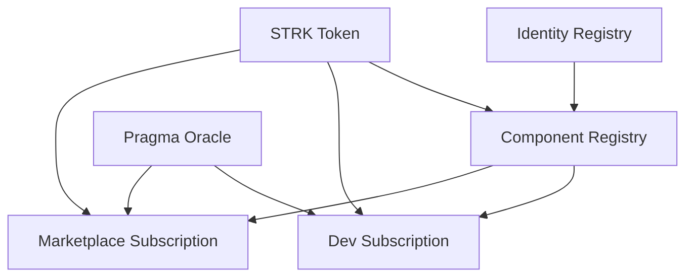

# StarkFlux - StarkNet Developer Components Marketplace

StarkFlux is a decentralized marketplace for StarkNet developer components, enabling developers to monetize their code components while providing the community with reusable, high-quality building blocks.

## 🚀 Features

- **Component Marketplace**: Browse, purchase, and download developer components
- **Multiple Monetization Models**: 
  - Direct purchase (one-time payment)
  - Developer subscriptions (subscribe to specific developers)
  - Marketplace subscriptions (access to all components)
  - Free components
- **Encrypted Storage**: Components are encrypted and stored on IPFS via Pinata
- **Smart Contract Architecture**: Fully decentralized on StarkNet
- **Modern UI**: React-based interface with real-time blockchain integration

## 📁 Project Structure

```
StarkFlux_v0.1/
├── UI/                                    # Frontend application
│   ├── StarkFlux_UI_Development_Guide.md  # UI development documentation
│   └── starkflux-ui/                     # React + TypeScript UI
├── packages/                             # Smart contracts
│   ├── common/                          # Shared interfaces and types
│   ├── component_registry/              # Main marketplace contract
│   ├── dev_subscription/                # Developer subscription system
│   ├── identity_registry/               # Developer identity management
│   └── marketplace_subscription/        # Global subscription system
├── src/                                 # (Additional source files)
├── .env.example                         # Environment variables example
├── .gitignore                          # Git ignore rules
├── CHANGELOG.md                        # Project changelog
├── CONTRIBUTING.md                     # Contribution guidelines
├── DEPLOYMENT.md                       # Deployment instructions
├── LICENSE                             # Source Available License
├── README.md                           # Project documentation
├── Scarb.lock                          # Cairo dependencies lock
├── Scarb.toml                          # Cairo project config
├── package.json                        # Node.js project config
└── package-lock.json                   # Node.js dependencies lock
```

## 🛠️ Technology Stack

- **Smart Contracts**: Cairo 1.0
- **Frontend**: React, TypeScript, Vite
- **UI Library**: Chakra UI
- **Blockchain Integration**: starknet.js, starknet-react
- **Storage**: IPFS (Pinata)
- **Network**: StarkNet Sepolia Testnet

## 🏗️ Smart Contract Architecture

StarkFlux operates on a comprehensive 4-contract ecosystem deployed on StarkNet Sepolia testnet (v1.2.0/v1.2.1):

### 📋 Contract Addresses

| Contract | Address | Version | Purpose |
|----------|---------|---------|---------|
| **Identity Registry** | [`0x079c5e6a08cab253e7bb4b57776d5ed0e66ca06bc01fc65f09fbf5ebdc397274`](https://sepolia.voyager.online/contract/0x079c5e6a08cab253e7bb4b57776d5ed0e66ca06bc01fc65f09fbf5ebdc397274) | v1.2.0 | Developer identity & reputation tracking |
| **Component Registry** | [`0x05fce2407338ddba93698b12af82275cbe62e1d9bcf7de63938cea642c894667`](https://sepolia.voyager.online/contract/0x05fce2407338ddba93698b12af82275cbe62e1d9bcf7de63938cea642c894667) | v1.2.1 | Main marketplace & component management |
| **Dev Subscription** | [`0x07c402205781ccd3b48b1b777c82cbc4a8eab20127bc3049fa2f6c7bfcfbc0ae`](https://sepolia.voyager.online/contract/0x07c402205781ccd3b48b1b777c82cbc4a8eab20127bc3049fa2f6c7bfcfbc0ae) | v1.2.0 | Developer-specific subscriptions |
| **Marketplace Subscription** | [`0x06e2c90a5fca956dc8c0e014e149c2708cb5ff1e7cf2c9345ff53599efbf90e1`](https://sepolia.voyager.online/contract/0x06e2c90a5fca956dc8c0e014e149c2708cb5ff1e7cf2c9345ff53599efbf90e1) | v1.2.0 | Global marketplace subscriptions |

### 🔗 Contract Interactions



**Flow Description:**
1. **Developer Registration**: Users register through Identity Registry to get a Developer ID
2. **Component Upload**: Registered developers upload components to Component Registry
3. **Access Control**: Component Registry verifies access through subscription contracts
4. **Payment Processing**: All payments handled via STRK token with automatic fee distribution

### 💰 Monetization Models & Fee Distribution

| Model | Access Flag | Revenue Split | Description |
|-------|-------------|---------------|-------------|
| **Direct Purchase** | `BUY (0x1)` | 80% Developer / 10% Platform / 10% Liquidity | One-time component purchase |
| **Developer Subscription** | `DEV_SUB (0x2)` | 80% Developer / 10% Platform / 10% Liquidity | Subscribe to specific developer |
| **Marketplace Subscription** | `MKT_SUB (0x4)` | 45% Reward Pool / 45% Platform / 10% Liquidity | Global marketplace access |
| **Free Components** | `FREE (0x8)` | No monetization | Open access components |

### 🔮 Oracle Integration

**Pragma Oracle**: [`0x36031daa264c24520b11d93af622c848b2499b66b41d611bac95e13cfca131a`](https://sepolia.voyager.online/contract/0x36031daa264c24520b11d93af622c848b2499b66b41d611bac95e13cfca131a)

- **Purpose**: Real-time USD to STRK price conversion for subscription fees
- **Feed**: STRK/USD price feed with staleness protection
- **Implementation**: Used in both Dev Subscription and Marketplace Subscription contracts
- **Fallback**: Fixed STRK pricing when Oracle is unavailable

### 🎁 Reward Distribution System

**Marketplace Subscription Rewards**:
- **Epoch Duration**: 30 days
- **Distribution Algorithm**: Square-root dampening with proportional allocation
- **New User Bonus**: 2x weight for first-time component discoverers
- **Anti-Abuse**: Download weighting prevents gaming the system

**Reward Calculation**:
```
user_reward = subscription_fee × (sqrt(user_downloads) / total_sqrt_downloads)
developer_reward = download_count × base_reward_per_download
```

### 🏛️ Infrastructure Addresses

| Service | Address | Purpose |
|---------|---------|---------|
| **STRK Token** | [`0x04718f5a0fc34cc1af16a1cdee98ffb20c31f5cd61d6ab07201858f4287c938d`](https://sepolia.voyager.online/contract/0x04718f5a0fc34cc1af16a1cdee98ffb20c31f5cd61d6ab07201858f4287c938d) | Payment token |
| **Platform Treasury** | `0x07458d134151De3fFb903eAf6F9ba7Fd7712d89215B9cCa4Fac5539A4C1d2351` | Platform fee collection |
| **Liquidity Vault** | `0x07458d134151De3fFb903eAf6F9ba7Fd7712d89215B9cCa4Fac5539A4C1d2351` | Liquidity provision rewards |

### 📊 Technical Specifications

- **Storage Pattern**: `LegacyMap<felt252, T>` for efficient key-value storage
- **Access Control**: Multi-contract verification with proper role management
- **Gas Optimization**: Batch operations and efficient state reading
- **Event System**: Comprehensive event emission for indexers and UI
- **Upgrade Safety**: Immutable core logic with configurable parameters

## 🚦 Getting Started

### Prerequisites

- Node.js 16+ and npm/yarn
- Rust and Scarb (for smart contract development)
- Git

### Installation

1. Clone the repository:
```bash
git clone hhttps://github.com/dragonsarealive/StarkFlux_v0.1.git
cd starkflux
```

2. Install UI dependencies:
```bash
cd UI/starkflux-ui
npm install
```

3. Set up environment variables:
```bash
cp .env.example .env.local
# Edit .env.local with your configuration
```

4. Start the development server:
```bash
npm run dev
```

### Smart Contract Development

1. Navigate to the packages directory:
```bash
cd packages
```

2. Build contracts:
```bash
scarb build
```

## 🔧 Configuration

### Environment Variables

Create a `.env.local` file in `UI/starkflux-ui/` with:

```env
VITE_PINATA_JWT=your_pinata_jwt_token
VITE_STARKNET_ALCHEMY_KEY=your_alchemy_api_key
```

### Contract Addresses

All contract addresses and detailed technical information can be found in the [Smart Contract Architecture](#🏗️-smart-contract-architecture) section above. The contracts are deployed on StarkNet Sepolia testnet with full integration and testing completed.

## 📖 Documentation

- [UI Development Guide](UI/StarkFlux_UI_Development_Guide.md)
- [Smart Contract Architecture](memory-bank/systemPatterns.md)
- [Technical Context](memory-bank/techContext.md)

## 🤝 Contributing

We welcome contributions! Please see our [Contributing Guidelines](CONTRIBUTING.md) for details.

1. Fork the repository
2. Create your feature branch (`git checkout -b feature/amazing-feature`)
3. Commit your changes (`git commit -m 'Add some amazing feature'`)
4. Push to the branch (`git push origin feature/amazing-feature`)
5. Open a Pull Request

## 📄 License

This project is under the **StarkFlux Source Available License v1.0** - see the [LICENSE](LICENSE) file for details.

**Important**: This is NOT an open source license. The code is source-available for:
- 🎓 Educational purposes
- 🔬 Evaluation and testing
- 🏆 Hackathon judging
- 💡 Personal projects

**Commercial use requires a separate license**. Contact us for commercial licensing options.

## 💼 Commercial Licensing

Interested in using StarkFlux for your business? We offer flexible commercial licensing options. Please contact andres.cano@reapstudios.com for more information.

## ⚠️ Security

- Never commit private keys or sensitive data
- Always use environment variables for secrets
- Report security vulnerabilities to [security@starkflux.com]

## 🌟 Acknowledgments

- StarkNet community
- Pragma Oracle for price feeds
- Pinata for IPFS infrastructure

---

**Note**: This project is currently on testnet. Do not use real funds. 
