# StarkFlux Architecture Analysis: C4 Model

**🎉 UPDATE**: All contracts successfully deployed to Sepolia testnet with v1.2.0 implementations as of May 26, 2025!

## Introduction

StarkFlux is a decentralized marketplace for Starknet developer components, allowing developers to sell, purchase, and subscribe to reusable code components on the Starknet blockchain. This document provides a comprehensive architecture analysis using the C4 model (Context, Container, Component, and Code), detailing both on-chain and off-chain aspects of the system.

## Deployment Status (v1.2.0)

| Contract | Version | Address |
|----------|---------|---------|
| **IdentityRegistry** | v1.2.0 | `0x079c5e6a08cab253e7bb4b57776d5ed0e66ca06bc01fc65f09fbf5ebdc397274` |
| **ComponentRegistry** | v1.2.1 | `0x05fce2407338ddba93698b12af82275cbe62e1d9bcf7de63938cea642c894667` |
| **DevSubscription** | v1.2.0 | `0x07c402205781ccd3b48b1b777c82cbc4a8eab20127bc3049fa2f6c7bfcfbc0ae` |
| **MarketplaceSubscription** | v1.2.0 | `0x06e2c90a5fca956dc8c0e014e149c2708cb5ff1e7cf2c9345ff53599efbf90e1` |

## 1. Context Diagram

The Context diagram shows StarkFlux within its ecosystem, illustrating how it interacts with external systems and users.

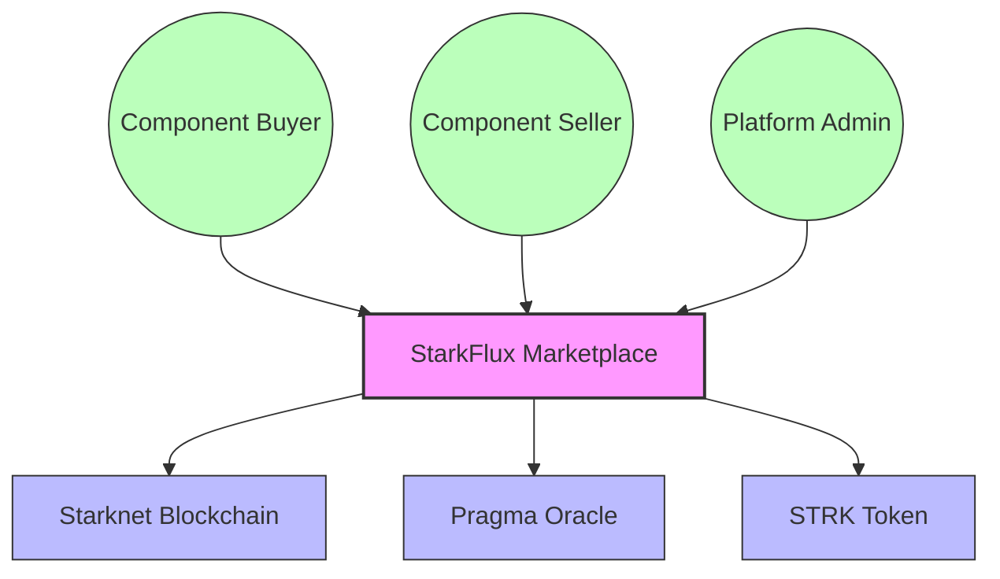

### Key Elements:

**Users/Actors:**
- **Component Buyers** - End users purchasing or subscribing to components
- **Component Sellers** - Developers registering and selling components
- **Platform Administrators** - Managing the platform, fees, and configurations

**External Systems:**
- **Starknet Blockchain** - The L2 blockchain where all contracts are deployed
- **Pragma Oracle** - Provides USD/STRK price feeds for stable USD pricing
- **STRK Token** - The native token used for all transactions

**Interactions:**
- Users interact with StarkFlux to buy, sell, and manage components
- StarkFlux executes all business logic on Starknet via smart contracts
- The Oracle provides price data for USD-priced components
- STRK tokens are used for all payments and transfers

## 2. Container Diagram

The Container diagram breaks down StarkFlux into its main containers: the smart contracts, frontend application, and supporting services.

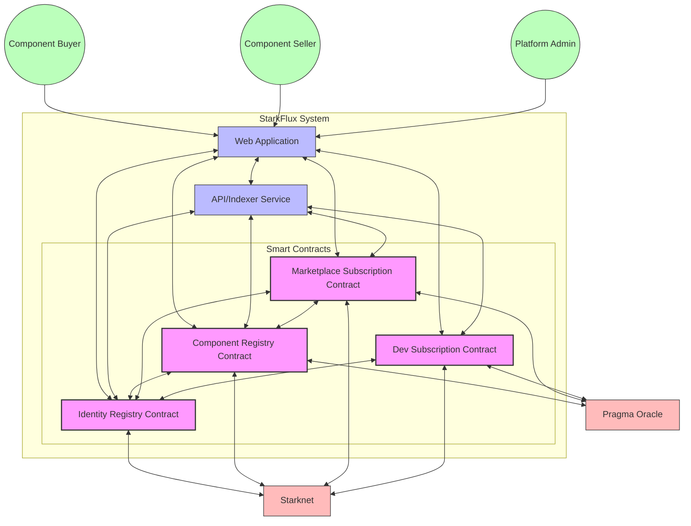

### Key Containers:

**Smart Contracts:**
- **Identity Registry Contract** - Manages developer identities and metrics
- **Component Registry Contract** - Manages component listings and purchases
- **Marketplace Subscription Contract** - Manages global marketplace subscriptions
- **Dev Subscription Contract** - Manages developer-specific subscriptions

**Off-chain Systems:**
- **Web Application** - React-based user interface for interacting with contracts
- **API/Indexer Service** - Indexes and serves blockchain data for efficient querying

**Interactions:**
- Smart contracts interact with each other (e.g., ComponentRegistry → IdentityRegistry)
- Web Application interacts with smart contracts via StarkNet.js
- API/Indexer Service processes blockchain events for efficient querying
- Note: DevSubscription does not have a direct connection to ComponentRegistry (architectural consideration)

## 3. Component Diagram

The Component diagram breaks down each container into its internal components.

### 3.1. Identity Registry Components

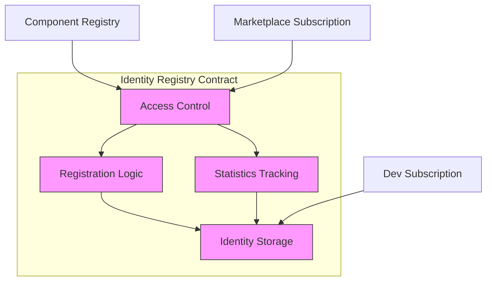

**Components:**
- **Identity Storage** - Manages identity records and metadata
- **Registration Logic** - Handles developer registration process
- **Access Control** - Ensures only authorized contracts can update records
- **Statistics Tracking** - Tracks uploads and sales for reputation scoring

### 3.2. Component Registry Components

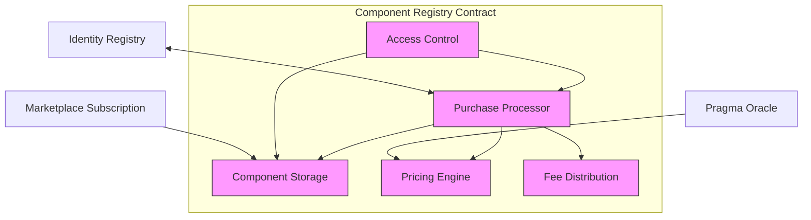

**Components:**
- **Component Storage** - Manages component metadata and listings
- **Pricing Engine** - Handles price calculations, including Oracle integration
- **Purchase Processor** - Processes component purchases
- **Fee Distribution** - Splits payments (80/10/10) between stakeholders
- **Access Control** - Manages permissions and access flags

### 3.3. Marketplace Subscription Components

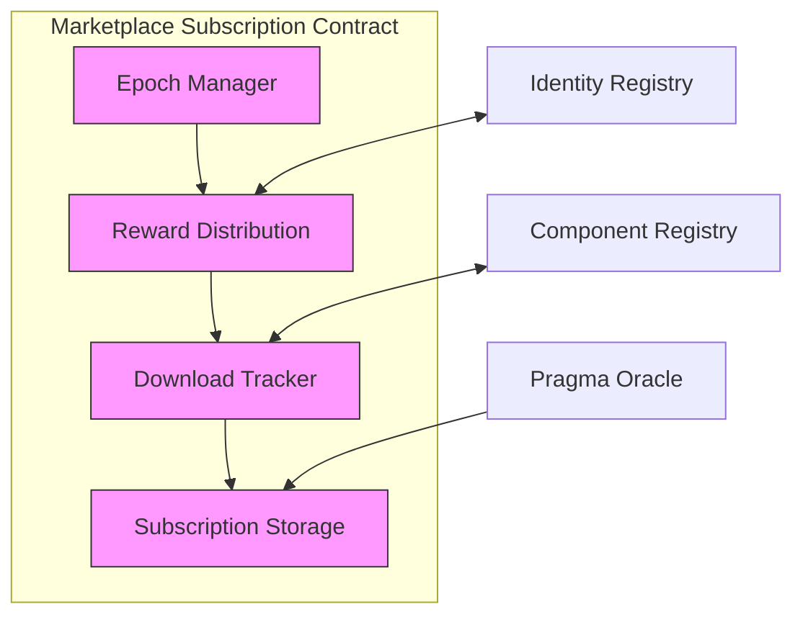

**Components:**
- **Subscription Storage** - Tracks user subscriptions and expiry
- **Download Tracker** - Records component downloads with weighting
- **Reward Distribution** - Distributes rewards based on usage metrics
- **Epoch Manager** - Manages subscription epochs and transitions

### 3.4. Dev Subscription Components

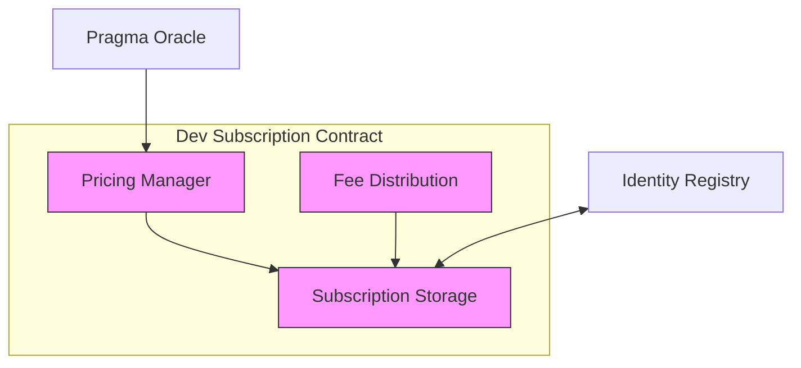

**Components:**
- **Subscription Storage** - Tracks developer-specific subscriptions
- **Pricing Manager** - Manages subscription pricing (STRK and USD)
- **Fee Distribution** - Splits payments (80/10/10) between stakeholders

### 3.5. Web Application Components

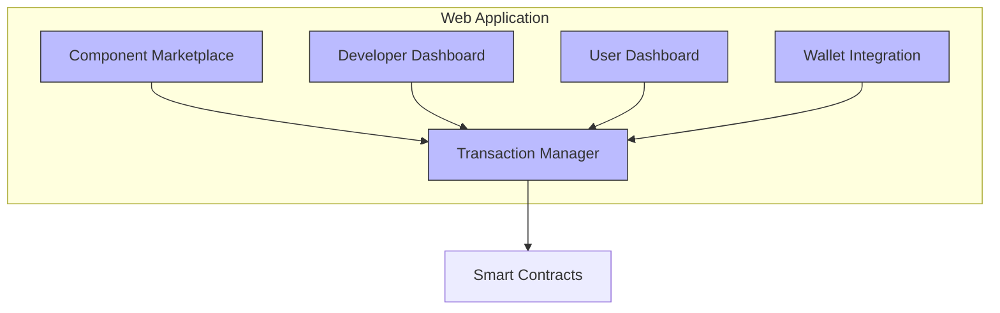

**Components:**
- **Component Marketplace** - Browsing and searching components
- **Developer Dashboard** - Managing components and developer profile
- **User Dashboard** - Managing purchases and subscriptions
- **Wallet Integration** - Connecting to StarkNet wallets
- **Transaction Manager** - Handling contract interactions

## 4. Code Diagram

The Code diagram details specific implementations within the components.

### 4.1. Identity Registry Code

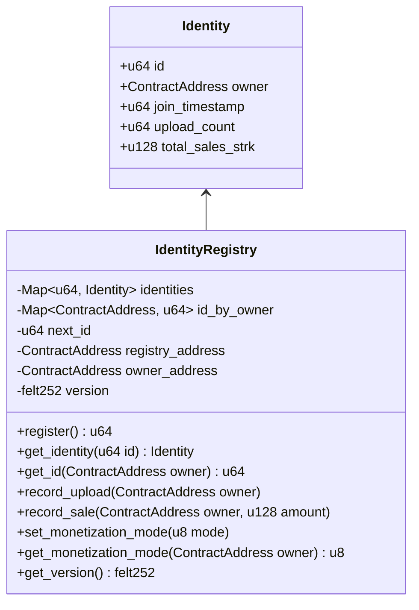

### 4.2. Component Registry Code

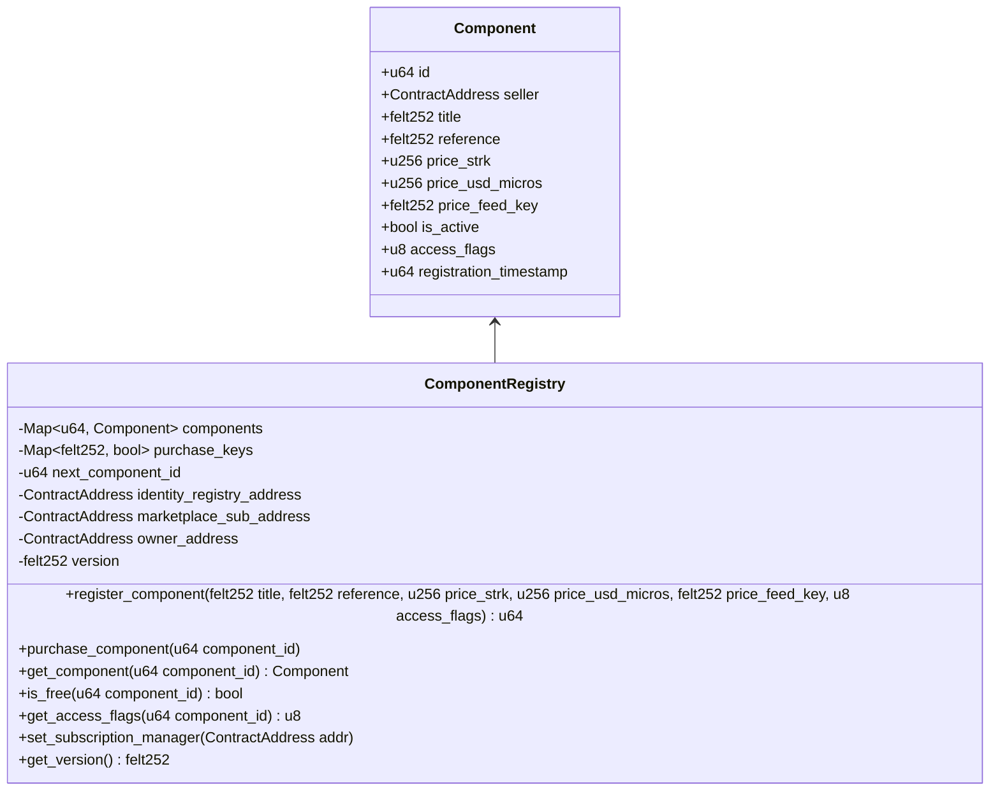

### 4.3. Marketplace Subscription Code

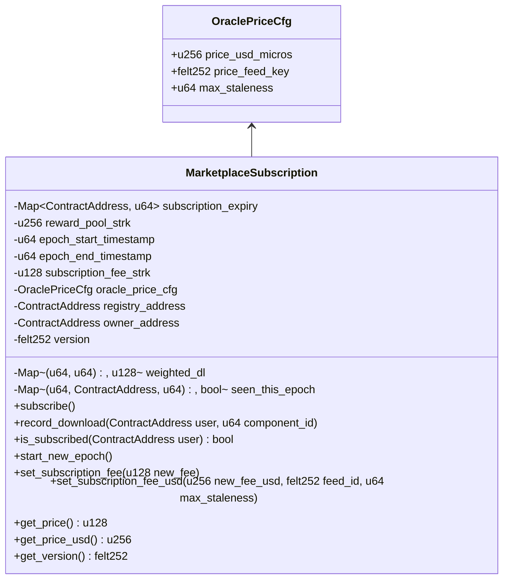

### 4.4. Dev Subscription Code

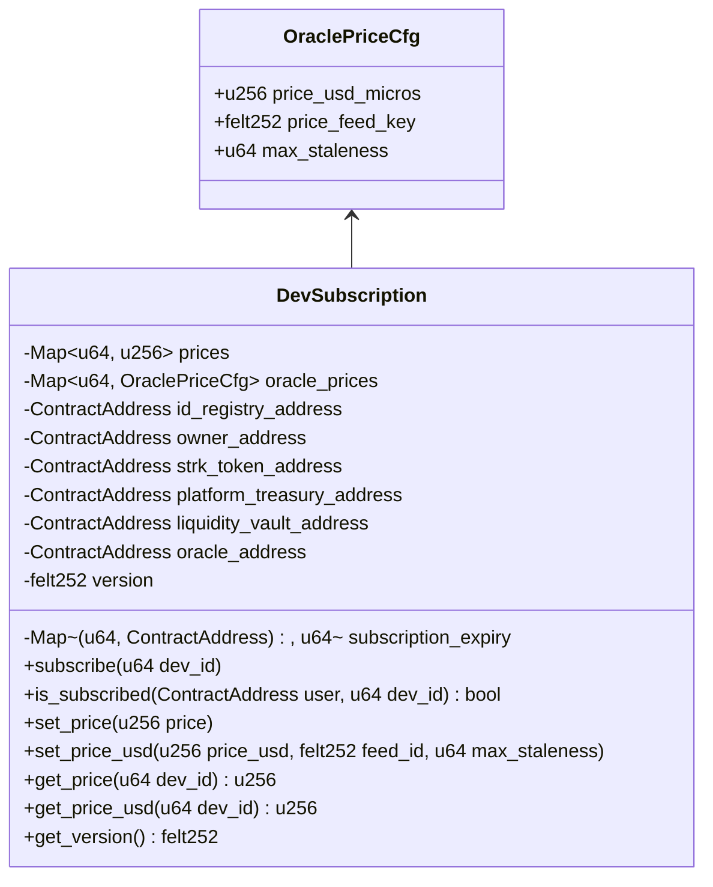

## 5. Key Architectural Considerations

### 5.1. Contract Relationships

- **IdentityRegistry → ComponentRegistry**: IdentityRegistry must have ComponentRegistry address set to allow recording sales and uploads
- **ComponentRegistry → MarketplaceSubscription**: ComponentRegistry must have MarketplaceSubscription address set for subscription verification
- **DevSubscription → IdentityRegistry**: DevSubscription interacts with IdentityRegistry for developer validation
- **Missing Link**: There is no direct connection between DevSubscription and ComponentRegistry, requiring UI-level integration

### 5.2. Access Flag System

Components use a bitmask system for access control:
- **BUY (1)**: Available for one-time purchase
- **DEV_SUB (2)**: Available via developer subscription
- **MKT_SUB (4)**: Available via marketplace subscription
- **FREE (8)**: Available without payment

### 5.3. Fee Distribution Models

Different monetization paths use different fee splits:
- **Direct Purchase**: 80/10/10 (Developer/Platform/Liquidity)
- **Marketplace Subscription**: 45/45/10 (Reward Pool/Platform/Liquidity)
- **Developer Subscription**: 80/10/10 (Developer/Platform/Liquidity)

### 5.4. Oracle Integration

USD pricing is supported through Pragma Oracle:
- **Price Feed**: Dynamic conversion between USD and STRK
- **Staleness Checks**: Ensure price data is recent
- **Fallback Mechanism**: Default to STRK pricing if Oracle is unavailable

### 5.5. Version Management

All contracts implement version tracking:
- **Storage Variable**: `version: felt252`
- **Constant**: `CONTRACT_VERSION: felt252 = 'v1.2.0'` (or 'v1.2.1' for ComponentRegistry)
- **View Function**: `get_version() -> felt252`

### 5.6. v1.2.0 Implementation Details

The v1.2.0 deployment addressed critical issues:
- **Storage Pattern**: All contracts now use `LegacyMap<felt252, T>` with helper functions
- **Key Generation**: Unique keys using pattern `id.into() * 1000000 + 'identifier'`
- **Oracle Integration**: Corrected to use Sepolia Oracle address
- **IdentityRegistry**: Completely rebuilt from non-functional state
- **Cross-Contract Links**: Established between IdentityRegistry and ComponentRegistry

## 6. Technical Constraints

- **Cairo Limitations**: String literals limited to 31 characters
- **Storage Efficiency**: Using Map instead of LegacyMap for better storage patterns
- **Cross-Contract Communication**: Limited to view functions and transaction calls
- **Oracle Data Reliability**: Staleness checks and fallback mechanisms required
- **StarkNet Specifics**: Parameter formatting, transaction handling

## 7. Conclusion

The StarkFlux architecture combines on-chain smart contracts with off-chain components to create a complete marketplace for developer components. The system supports multiple monetization paths, flexible pricing models, and subscription-based access. The architecture follows best practices for security, performance, and user experience, while acknowledging technical constraints and implementation challenges.

## 7. Conclusion