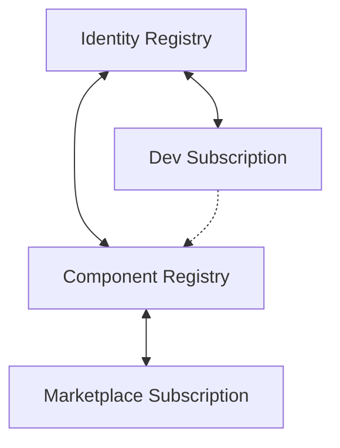

# StarkFlux Ecosystem Contract Management Guide

## Executive Summary

This document serves as the definitive reference for managing the StarkFlux ecosystem's smart contracts. StarkFlux is a decentralized marketplace for StarkNet developer components, enabling developers to register, sell, purchase, and subscribe to reusable code components. The ecosystem consists of four main smart contracts that manage different aspects of the platform, deployed on the StarkNet Sepolia testnet.

**🎉 UPDATE**: All contracts have been successfully upgraded to v1.2.0 and deployed on May 26, 2025.

## Contract Addresses & Class Hashes (v1.2.0)

| Contract | Deployed Address | Class Hash | Version |
|----------|------------------|------------|---------|
| IdentityRegistry | `0x079c5e6a08cab253e7bb4b57776d5ed0e66ca06bc01fc65f09fbf5ebdc397274` | `0x057fb470499f03ffec23b2f0273f59ac9a0b2713194e11f5ab97da63977014d6` | v1.2.0 |
| ComponentRegistry | `0x05fce2407338ddba93698b12af82275cbe62e1d9bcf7de63938cea642c894667` | `0x032402e135e3355138bcd8d055af9c19e1e00dbdd921643af0d087cf70857f1a` | v1.2.1 |
| DevSubscription | `0x07c402205781ccd3b48b1b777c82cbc4a8eab20127bc3049fa2f6c7bfcfbc0ae` | `0x00cf11b782facf641db47203f4486c0e7862468e022a191641b91b0536ffece5` | v1.2.0 |
| MarketplaceSubscription | `0x06e2c90a5fca956dc8c0e014e149c2708cb5ff1e7cf2c9345ff53599efbf90e1` | `0x035e3cb1e0e89d1895bba2c02fd13f7ece2536bc5b816d12fc3e1345ababf3ee` | v1.2.0 |

### External Dependencies

| Contract | Address | Purpose |
|----------|---------|---------|
| STRK Token | `0x04718f5a0fc34cc1af16a1cdee98ffb20c31f5cd61d6ab07201858f4287c938d` | Native token for payments |
| Pragma Oracle | `0x36031daa264c24520b11d93af622c848b2499b66b41d611bac95e13cfca131a` | Price feed for USD pricing (Sepolia) |

## Contract Purposes & Relationships

### Identity Registry

**Purpose**: Manages developer identities and tracks metrics like uploads and sales.

**Key Responsibilities**:
- Developer registration and identity management
- Tracking upload counts and sales statistics
- Managing developer monetization modes

### Component Registry

**Purpose**: Manages component listings, purchases, and access control.

**Key Responsibilities**:
- Component registration and metadata storage
- Processing one-time purchases
- Managing component access flags
- Fee distribution for direct purchases (80/10/10)

### Marketplace Subscription

**Purpose**: Handles global subscription to marketplace components.

**Key Responsibilities**:
- Marketplace subscription management
- Epoch-based reward distribution
- Usage tracking for components
- Fee distribution (45/45/10)

### Dev Subscription

**Purpose**: Manages developer-specific subscriptions.

**Key Responsibilities**:
- Developer subscription management
- Developer-specific pricing
- Fee distribution (80/10/10)

## Contract Relationships



**Key Relationships**:
1. **IdentityRegistry → ComponentRegistry**: IdentityRegistry needs the ComponentRegistry address to record sales and uploads.
2. **ComponentRegistry → MarketplaceSubscription**: ComponentRegistry needs MarketplaceSubscription address to verify subscription status.
3. **DevSubscription → IdentityRegistry**: DevSubscription uses IdentityRegistry for developer validation.
4. **Missing Connection**: There is no direct connection between DevSubscription and ComponentRegistry, requiring UI-level integration.

## Key Management Functions

### Identity Registry

| Function | Purpose | Parameters |
|----------|---------|------------|
| `register()` | Register a new developer identity | None |
| `set_monetization_mode(mode)` | Set the monetization mode for a developer | `mode`: u8 (0=free only, 1=paid allowed) |
| `get_identity(id)` | Retrieve developer identity details | `id`: u64 |
| `record_upload(owner)` | Record component upload | `owner`: ContractAddress |
| `record_sale(owner, amount)` | Record sales for a developer | `owner`: ContractAddress, `amount`: u128 |
| `set_registry_address(addr)` | Set the ComponentRegistry address | `addr`: ContractAddress |
| `get_version()` | Get contract version | None |

### Component Registry

| Function | Purpose | Parameters |
|----------|---------|------------|
| `register_component(...)` | Register a new component | `title`: felt252, `reference`: felt252, `price_strk`: u256, `price_usd_micros`: u256, `price_feed_key`: felt252, `access_flags`: u8 |
| `purchase_component(component_id)` | Process a component purchase | `component_id`: u64 |
| `set_subscription_manager(addr)` | Set the MarketplaceSubscription address | `addr`: ContractAddress |
| `is_free(component_id)` | Check if a component is free | `component_id`: u64 |
| `get_component(component_id)` | Get component details | `component_id`: u64 |
| `get_version()` | Get contract version | None |

### Marketplace Subscription

| Function | Purpose | Parameters |
|----------|---------|------------|
| `subscribe()` | Subscribe to the marketplace | None |
| `record_download(user, component_id)` | Record component download/usage | `user`: ContractAddress, `component_id`: u64 |
| `start_new_epoch()` | Start a new reward epoch | None |
| `set_subscription_fee(new_fee)` | Set the STRK subscription fee | `new_fee`: u128 |
| `set_subscription_fee_usd(...)` | Set the USD subscription fee | `new_fee_usd`: u256, `feed_id`: felt252, `max_staleness`: u64 |
| `get_price()` | Get current subscription price in STRK | None |
| `get_price_usd()` | Get current subscription price in USD | None |
| `get_version()` | Get contract version | None |

### Dev Subscription

| Function | Purpose | Parameters |
|----------|---------|------------|
| `subscribe(dev_id)` | Subscribe to a specific developer | `dev_id`: u64 |
| `is_subscribed(user, dev_id)` | Check subscription status | `user`: ContractAddress, `dev_id`: u64 |
| `set_price(price)` | Set subscription price in STRK | `price`: u256 |
| `set_price_usd(...)` | Set subscription price in USD | `price_usd`: u256, `feed_id`: felt252, `max_staleness`: u64 |
| `get_price(dev_id)` | Get current subscription price in STRK | `dev_id`: u64 |
| `get_price_usd(dev_id)` | Get current subscription price in USD | `dev_id`: u64 |
| `get_version()` | Get contract version | None |

## Access Control System

### Component Access Flags

Components use a bitmask system for access control:

| Flag | Bit Value | Description | Fee Split |
|------|-----------|-------------|-----------|
| BUY | 1 (0b0001) | Available for one-time purchase | 80/10/10 (Dev/Platform/Liquidity) |
| DEV_SUB | 2 (0b0010) | Available via developer subscription | 80/10/10 (Dev/Platform/Liquidity) |
| MKT_SUB | 4 (0b0100) | Available via marketplace subscription | 45/45/10 (Reward Pool/Platform/Liquidity) |
| FREE | 8 (0b1000) | Available without payment | N/A |

**Important Notes**:
- FREE flag cannot be combined with other flags
- Components can have multiple access methods (BUY, DEV_SUB, MKT_SUB)
- FREE components must have zero price in both STRK and USD

### Developer Monetization Modes

| Mode | Value | Description |
|------|-------|-------------|
| Free Only | 0 | Developer can only create free components |
| Paid Allowed | 1 | Developer can create both free and paid components (default) |

## Fee Distribution Models

Different monetization paths use different fee splits:

| Access Type | Developer | Platform | Liquidity | Reward Pool |
|-------------|-----------|----------|-----------|-------------|
| Direct Purchase | 80% | 10% | 10% | - |
| Marketplace Subscription | - | 45% | 10% | 45% |
| Developer Subscription | 80% | 10% | 10% | - |

## Oracle Integration

USD pricing is supported through Pragma Oracle:

### OraclePriceCfg Structure

```cairo
struct OraclePriceCfg {
    price_usd_micros: u256,
    price_feed_key: felt252,
    max_staleness: u64
}
```

### Key Parameters

- `price_feed_key`: Determines which price pair to use (e.g., STRK/USD)
- `max_staleness`: Maximum acceptable age of price data in seconds
- `price_usd_micros`: Price in USD (1 USD = 1,000,000 micros)

## Configuration Parameters

### Storage Variables

| Contract | Variable | Type | Purpose |
|----------|----------|------|---------|
| All | `version` | felt252 | Stores contract version |
| IdentityRegistry | `next_id` | u64 | Auto-incrementing ID for developers |
| ComponentRegistry | `next_component_id` | u64 | Auto-incrementing ID for components |
| MarketplaceSubscription | `epoch_start_timestamp` | u64 | Start of current epoch |
| MarketplaceSubscription | `epoch_end_timestamp` | u64 | End of current epoch |
| MarketplaceSubscription | `reward_pool_strk` | u256 | Current reward pool amount |

### Constants

| Contract | Constant | Value | Purpose |
|----------|----------|-------|---------|
| All | `CONTRACT_VERSION` | 'v1.1.0' | Current contract version |

## Network Information

| Property | Value |
|----------|-------|
| Network | StarkNet Sepolia Testnet |
| Initial Deployment | May 2025 (v1.1.0) |
| Latest Deployment | May 26, 2025 (v1.2.0) |
| Current Version | v1.2.0/v1.2.1 |

## Version Management

All contracts implement version tracking with:

1. **Contract Constant**: `CONTRACT_VERSION: felt252 = 'v1.2.0'` (or 'v1.2.1' for ComponentRegistry)
2. **Storage Variable**: `version: felt252`
3. **View Function**: `get_version() -> felt252`

### v1.2.0 Improvements
- Fixed all Map storage issues using `LegacyMap<felt252, T>` pattern
- Implemented storage helper functions for clean abstraction
- Corrected Oracle address from Mainnet to Sepolia
- Added complete functionality to IdentityRegistry (was non-functional)
- Enhanced all contracts with proper error handling and validation

## Common Operations Guide

### Managing Component Registry

#### Registering a Component

```bash
# Using Starkli
starkli invoke ${COMPONENT_REGISTRY} register_component "Component Title" "ipfs://QmReference..." u256:1000000000000000000 0 0 1
```

#### Setting Subscription Manager Address

```bash
# Using Starkli
starkli invoke ${COMPONENT_REGISTRY} set_subscription_manager ${MARKETPLACE_SUBSCRIPTION}
```

### Managing Marketplace Subscription

#### Setting Subscription Fee (STRK)

```bash
# Using Starkli
starkli invoke ${MARKETPLACE_SUBSCRIPTION} set_subscription_fee 10000000000000000000 # 10 STRK
```

#### Setting Subscription Fee (USD)

```bash
# Using Starkli
starkli invoke ${MARKETPLACE_SUBSCRIPTION} set_subscription_fee_usd u256:10000000 "STRK/USD" 3600 # $10 with 1-hour staleness
```

#### Starting a New Epoch

```bash
# Using Starkli
starkli invoke ${MARKETPLACE_SUBSCRIPTION} start_new_epoch
```

### Managing Dev Subscription

#### Setting Subscription Price (STRK)

```bash
# Using Starkli
starkli invoke ${DEV_SUBSCRIPTION} set_price u256:5000000000000000000 # 5 STRK
```

#### Setting Subscription Price (USD)

```bash
# Using Starkli
starkli invoke ${DEV_SUBSCRIPTION} set_price_usd u256:5000000 "STRK/USD" 3600 # $5 with 1-hour staleness
```

## Monitoring Recommendations

### Key Events to Monitor

| Contract | Event | Importance |
|----------|-------|------------|
| IdentityRegistry | `IdentityRegistered` | Track new developers |
| ComponentRegistry | `ComponentRegistered` | Track new components |
| ComponentRegistry | `ComponentPurchased` | Track sales |
| MarketplaceSubscription | `Subscribed` | Track new subscriptions |
| MarketplaceSubscription | `EpochStarted` | Track epoch transitions |
| DevSubscription | `Subscribed` | Track developer subscriptions |

## Upgrade Process

To upgrade a contract:

1. **Generate New Class Hash**:
   - Update storage variables or functions 
   - Update `CONTRACT_VERSION` constant
   - Compile with `scarb build`
   - Run `fix_artifacts_unix.sh`

2. **Deploy New Contract Class**:
   - Use Starkli to declare new contract class
   - Deploy using existing contract state

3. **Update References**:
   - Update any contracts that reference the upgraded contract

## Emergency Procedures

### Handling Critical Vulnerabilities

1. **Pause Affected Contracts** (if pause functionality exists)
2. **Notify Key Stakeholders**
3. **Prepare Emergency Fix**
4. **Deploy Updated Contracts**
5. **Verify and Resume Operations**

## Contact Information

| Role | Contact | Responsibility |
|------|---------|----------------|
| Lead Developer | TBD | Technical oversight, emergency response |
| Contract Admin | TBD | Day-to-day administration |
| Financial Admin | TBD | Fee and reward management |

## Documentation References

- [StarkFlux Architecture Analysis](./StarkFlux_Architecture_Analysis.md)
- [StarkFlux Contract Interaction Guide](./StarkFlux_Contract_Interaction_Guide.md)
- [StarkFlux UI Development Guide](./StarkFlux_UI_Development_Guide.md) 