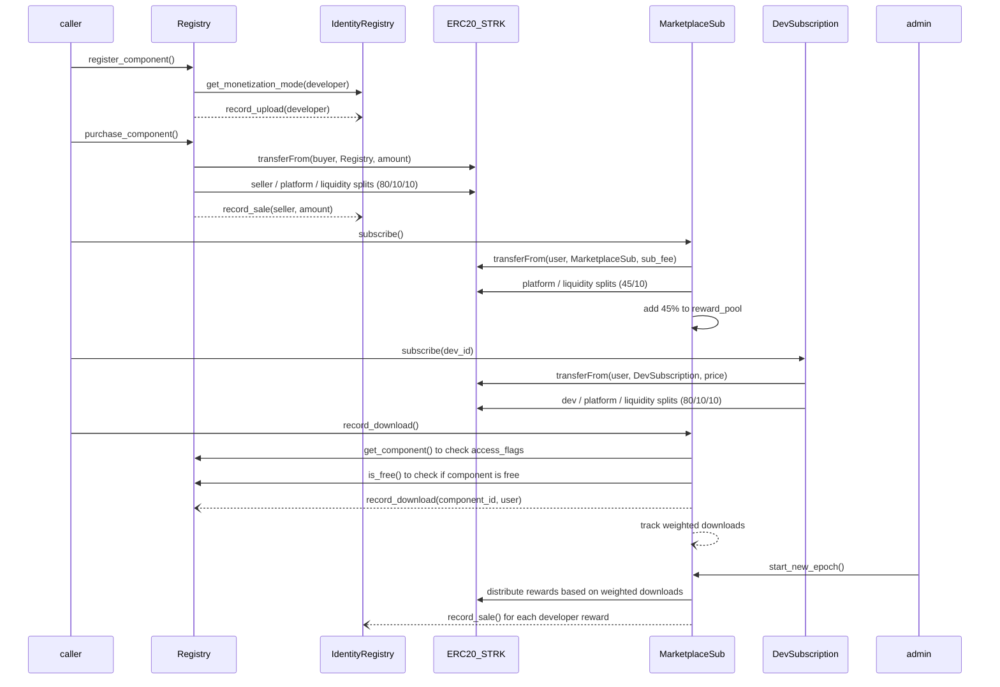

# StarkFlux: Starknet Dev-Components Marketplace
# Consolidated Requirements Document

## Table of Contents
- [1. Project Overview](#1-project-overview)
  - [1.1 Project Goal](#11-project-goal)
  - [1.2 Technical Stack](#12-technical-stack)
  - [1.3 Directory Structure](#13-directory-structure)
  - [1.4 Revenue Distribution Model](#14-revenue-distribution-model)
  - [1.5 Component Access Model](#15-component-access-model)
- [2. Smart Contract Requirements](#2-smart-contract-requirements)
  - [2.1 ComponentRegistryV2](#21-componentregistryv2)
  - [2.2 IdentityRegistry](#22-identityregistry)
  - [2.3 MarketplaceSubscription](#23-marketplacesubscription)
  - [2.4 DevSubscription](#24-devsubscription)
  - [2.5 Cross-Contract Flow Diagram](#25-cross-contract-flow-diagram)
- [3. Development & Deployment Process](#3-development--deployment-process)
  - [3.1 Development Environment Setup](#31-development-environment-setup)
  - [3.2 Build Process](#32-build-process)
  - [3.3 Deployment Checklist](#33-deployment-checklist)
- [4. Testing Framework](#4-testing-framework)
  - [4.1 Testing Environment Setup](#41-testing-environment-setup)
  - [4.2 Writing Tests](#42-writing-tests)
  - [4.3 Testing Patterns](#43-testing-patterns)
- [5. UI Implementation Guide](#5-ui-implementation-guide)
  - [5.1 UI Architecture](#51-ui-architecture)
  - [5.2 User Roles](#52-user-roles)
  - [5.3 Component Access Models](#53-component-access-models)
  - [5.4 Pages and Views](#54-pages-and-views)
  - [5.5 Core UI Components](#55-core-ui-components)
  - [5.6 User Journeys](#56-user-journeys)
  - [5.7 Responsive Design](#57-responsive-design)
  - [5.8 Brave Browser Optimization](#58-brave-browser-optimization)

## 1. Project Overview

### 1.1 Project Goal

The primary goal is to implement a decentralized marketplace for Starknet developer components. This marketplace will consist of four core, composable Cairo 1.1 smart contracts:

1. **ComponentRegistryV2**: Handles component listings, purchases, and dynamic pricing mechanisms (STRK or USD-based).
2. **IdentityRegistry**: Manages developer identities and tracks their marketplace activity (uploads, sales).
3. **MarketplaceSubscription**: Manages marketplace-wide STRK-based subscription access to eligible components, with pooled rewards distributed based on actual usage.
4. **DevSubscription**: Manages developer-specific subscriptions for accessing components from a particular developer.

All contracts must compile with Scarb 2+, expose their ABI using `#[abi(embed_v0)]`, and be deployable and operational on the Starknet Sepolia testnet.

### 1.2 Technical Stack

* **Language:** Cairo 1.1
* **Build Tool:** Scarb 2+
* **Testing:** Starknet Foundry with snforge
* **Target Network:** Starknet Sepolia testnet
* **Frontend Framework:** React with TypeScript
* **UI Component Library:** Chakra UI
* **StarkNet Integration:** 
  * StarkNet.js for contract interaction
  * Starknet React for hooks and state management
  * StarknetKit for wallet connection

### 1.3 Directory Structure

```
starknet-dev-components-marketplace/
 ├ src/
 │  ├ component_registry_v2.cairo
 │  ├ identity_registry.cairo       
 │  ├ marketplace_subscription.cairo
 │  ├ dev_subscription.cairo       
 │  ├ interfaces.cairo              // Contains all trait definitions
 │  ├ types.cairo                   // Shared structs/enums
 │  ├ math_utils.cairo              // Shared math helper functions
 │  └ lib.cairo                     // Declares modules: interfaces, types, math_utils
 ├ scripts/
 │  ├ fix_artifacts.sh              // Script to fix artifact issues
 │  └ deploy.sh                     // Deployment script
 ├ tests/                           // Test files
 ├ Scarb.toml
 └ README.md 
```

### 1.4 Revenue Distribution Model

| Revenue type      | Developer | MarketplaceVault| LiquidityVault  |
|-------------------|-----------|-----------------|-----------------|
| One-off licence   | 80%       | 10%             | 10%             |
| Marketplace sub   | 45% (via reward_pool)| 45% | 10%             |
| Developer sub     | 80%       | 10%             | 10%             |
| FREE components   | N/A       | N/A             | N/A             |

### 1.5 Component Access Model

The marketplace supports four types of component monetization through access flags:

| Flag         | Value | Description                                   |
|--------------|-------|-----------------------------------------------|
| BUY          | 1     | One-time purchase required                    |
| DEV_SUB      | 2     | Available via developer subscription          |
| MKT_SUB      | 4     | Available via marketplace subscription        |
| FREE         | 8     | Free for everyone to download                 |

Notes:
- The FREE flag cannot be combined with other flags
- FREE components must have zero price
- Components can only use BUY flag if developer has monetization_mode != 0
- Appropriate validation exists in register_component() and update_component()
- purchase_component() blocks purchases of FREE components
- is_free() and get_access_flags() view functions help UI handle components

## 2. Smart Contract Requirements

### 2.1 ComponentRegistryV2

| Item              | Details                                                                            |
|-------------------|------------------------------------------------------------------------------------|
| **Purpose**       | Catalogue components, hold pricing, trigger one-shot purchases, dispatch admin config |
| **Storage (main)**| `components`, `purchases`, fee BPs, oracle address, owner, …               |
| **External calls**| *Pragma Oracle*, **STRK** ERC-20, **IdentityRegistry** (`record_upload`, `sale`, `get_monetization_mode`)    |
| **Events**        | `ComponentRegistered`, `ComponentPurchased`, plus ownership / fee update events    |
| **Access-control**| `owner_address` with two-step transfer                                             |
| **Fee logic**     | `_handle_payment_distribution` (seller / platform / liquidity split)               |
| **Oracle guard**  | staleness, zero-price, decimals scaling                                            |
| **Error constants**| `ERR_OWNER_ONLY`, `ERR_ALREADY_REGISTERED`, `ERR_PRICE_TOO_LARGE`, …              |
| **Unit tests**    | price calc (fixed + oracle), fee caps, purchase flow, admin setters                |
| **Required Additions**     | `record_download` forwarder with access_flags check, FREE component support, is_free() & get_access_flags() view functions, monetization mode enforcement |
| **Fee split**     | Hardcoded seller=8000, platform=1000, liq=1000 (80/10/10 for one-off)             |

### 2.2 IdentityRegistry

| Item                  | Requirement                                                                                                                         |
|-----------------------|-------------------------------------------------------------------------------------------------------------------------------------|
| **Purpose**           | Map each developer address to a unique `identity_id`; track upload count and cumulative STRK sales; manage monetization mode                                  |
| **Storage**           | ```cairo
struct Identity {
  id: u64,
  owner: ContractAddress,
  join_timestamp: u64,
  upload_count: u64,
  total_sales_strk: u128,
  monetization_mode: u8     // 0=Free-only, 1=Paid allowed (default)
}
next_id: u64
id_by_owner: LegacyMap<ContractAddress,u64>
identities: LegacyMap<u64,Identity>
``` |
| **Events**            | `IdentityRegistered{id,owner}` · `UploadRecorded{id}` · `SaleRecorded{id,amount}`                                                   |
| **External API**      | `register()` · `get_identity(id)` · `get_id(owner)` · `record_upload(owner)` · `record_sale(owner,amount)` · `set_monetization_mode(mode)` · `get_monetization_mode(owner)`                           |
| **Access-control**    | `onlyComponentRegistry` guard on both *record_* functions; owner can `set_registry_address`                                         |
| **Error codes**       | `ERR_ALREADY_REGISTERED`, `ERR_NOT_REGISTERED`, `ERR_NOT_COMPONENT_REGISTRY`, `ERR_ZERO_ADDRESS`                                    |
| **Upgrade note**      | All maps keyed by fixed-width ints → painless data migration to future versions                                                     |
| **Monetization Modes**| 0: Free-only (no BUY flag allowed), 1: Paid allowed (default)                                                  |

### 2.3 MarketplaceSubscription

| Item                  | Requirement                                                                                                                         |
|-----------------------|-------------------------------------------------------------------------------------------------------------------------------------|
| **Purpose**           | Provide **renewable, market-wide subscription** access to components flagged with MKT_SUB access flag, with pooled rewards           |
| **Storage**           | ```cairo
struct Storage {
  subscription_expiry: LegacyMap<ContractAddress /*user*/, u64>,
  weighted_dl: LegacyMap<(ContractAddress /*developer*/, u64 /*component_id*/), u64>,
  seen_this_epoch: LegacyMap<(ContractAddress /*user*/, ContractAddress /*dev*/, u64 /*comp_id*/), bool>,
  reward_pool_strk: u128,
  epoch_start_timestamp: u64,
  epoch_end_timestamp: u64,
  subscription_fee_strk: u128,
  oracle_price_cfg: OraclePriceCfg,
  new_user_bonus: u8, // multiplier for first-time downloads
  // Address & fee settings
  owner_address: ContractAddress,
  registry_address: ContractAddress,
  id_registry_address: ContractAddress,
  strk_token_address: ContractAddress,
  platform_treasury_address: ContractAddress,
  liquidity_vault_address: ContractAddress,
}
``` |
| **Config params**     | `strk_token_address`, `platform_treasury_address`, `liquidity_vault_address`, `oracle_address` |
| **Events**            | `Subscribed{user,expiry,price}` · `SubscriptionFeeChanged{old_fee,new_fee}` · `EpochStarted{start,end,reward_pool}` · `DownloadRecorded{user,developer,component_id,weight}` · `RewardPaid{developer,amount}` |
| **External API**      | `subscribe()` · `record_download(user,component_id)` · `start_new_epoch()` · `set_subscription_fee(new_fee)` · `set_subscription_fee_usd(new_fee_usd,feed_id,max_staleness)` · `is_subscribed(user)` · `get_price()` · `get_price_usd()` |
| **Fee logic**         | Fixed 45/45/10 split (developer/platform/liquidity)                                                         |
| **Weight formula**    | +2 for first-ever wallet·component, else +1; square-root dampening on payout                                |
| **Oracle support**    | USD pricing with Pragma Oracle integration and staleness checks                                             |
| **Inter-contract**    | • Check access flags via `ComponentRegistry.get_component` (view) <br>• STRK `transferFrom` user → MarketplaceSub then split <br>• Check for FREE components via `ComponentRegistry.is_free` <br>• Distribute rewards to developers via STRK transfers |
| **Error codes**       | `ERR_NOT_ELIGIBLE`, `ERR_ALREADY_SUBSCRIBED`, `ERR_SUB_EXPIRED`, `ERR_EPOCH_ACTIVE`, `ERR_REWARD_DISTRIBUTION`, `ERR_ORACLE_PRICE_STALE` |
| **Access-control**    | Public subscribe; admin-only epoch management & fee setting                                                  |
| **Constants**         | `EPOCH_LENGTH = 2,592,000 s (30 d)` · `GRACE_WINDOW = 21,600 s (6 h)`                                       |

### 2.4 DevSubscription

| Item                  | Requirement                                                                                                                         |
|-----------------------|-------------------------------------------------------------------------------------------------------------------------------------|
| **Purpose**           | Provide **renewable, developer-specific subscription** access to components flagged with DEV_SUB access flag                           |
| **Storage**           | ```cairo
struct Storage {
  subscription_expiry: LegacyMap<(u64 /*devId*/, ContractAddress /*user*/), u64>,
  dev_prices: LegacyMap<u64 /*devId*/, u256>,
  oracle_price_cfg: LegacyMap<u64 /*devId*/, OraclePriceCfg>,
  // Address & fee settings
  owner_address: ContractAddress,
  id_registry_address: ContractAddress,
  strk_token_address: ContractAddress,
  platform_treasury_address: ContractAddress,
  liquidity_vault_address: ContractAddress,
  oracle_address: ContractAddress,
}
``` |
| **Config params**     | `strk_token_address`, `platform_treasury_address`, `liquidity_vault_address`, `oracle_address` |
| **Events**            | `Subscribed{user,developer,expiry,price}` · `PriceChanged{developer,old_price,new_price}`      |
| **External API**      | `subscribe(developer)` · `set_price(price)` · `set_price_usd(price_usd,feed_id,max_staleness)` · `is_subscribed(user,developer)` · `get_price(developer)` · `get_price_usd(developer)` |
| **Fee logic**         | Fixed 80/10/10 split (developer/platform/liquidity)                                               |
| **Oracle support**    | USD pricing with Pragma Oracle integration and staleness checks                                  |
| **Inter-contract**    | • Identity verification via `IdentityRegistry` <br>• STRK `transferFrom` user → DevSubscription then split |
| **Error codes**       | `ERR_INVALID_DEVELOPER`, `ERR_INVALID_PRICE`, `ERR_NOT_AUTHORIZED`, `ERR_ORACLE_PRICE_STALE`     |
| **Access-control**    | Public subscribe; developer or owner can set price                                               |
| **Constants**         | `SUBSCRIPTION_PERIOD = 2,592,000 s (30 d)` · `DEVELOPER_FEE_BPS = 8000` · `PLATFORM_FEE_BPS = 1000` · `LIQUIDITY_FEE_BPS = 1000` |

### 2.5 Cross-Contract Flow Diagram



## 3. Development & Deployment Process

### 3.1 Development Environment Setup

1. **Install Cairo/Scarb:**
   ```bash
   curl -L https://raw.githubusercontent.com/software-mansion/scarb/main/install.sh | sh
   scarb --version  # Verify installation
   ```

2. **Install Starkli (for deployment):**
   ```bash
   curl -L https://raw.githubusercontent.com/starknet-io/starknet.js/develop/packages/starkli/install.sh | sh
   starkli --version  # Verify installation
   ```

3. **Install Starknet Foundry (for testing):**
   ```bash
   curl -L https://raw.githubusercontent.com/foundry-rs/starknet-foundry/master/scripts/install.sh | sh
   snfoundryup
   snforge --version  # Verify installation
   ```

4. **Set up Starknet Sepolia account:**
   - Install ArgentX or Braavos browser extension
   - Create a Sepolia testnet account
   - Fund it from the Sepolia faucet
   - Export account details for CLI use

5. **Get a Sepolia RPC URL:**
   - Sign up with Infura, Alchemy, or Blast
   - Create a Starknet API key
   - Copy the Sepolia endpoint URL

### 3.2 Build Process

1. Write Cairo contracts (`src/`).
2. Compile contracts: `scarb build`.
3. Debug any compilation failures.
4. Run fix_artifacts.sh script to create correct artifacts with proper module path references.
5. Deploy using fixed artifacts.
6. Test contracts: `snforge test`.

#### Artifact Fix Process

1. Configure Scarb.toml with correct contract-name and module-path entries for each contract.
2. Run scarb build to generate initial compiled files.
3. Execute fix_artifacts.sh which:
   - Creates correctly named artifact JSON files with proper module paths
   - Renames compiled class files to match artifact references
4. Use the fixed artifacts for deployment or testing.

### 3.3 Deployment Checklist

1. **Deploy external dependencies or use existing ones:**
   - ERC-20 (STRK Token)
   - Price Oracle (Pragma)
   - Set Treasury and Vault addresses

2. **Deploy IdentityRegistry:**
   ```bash
   starkli declare target/fixed/identity_registry.contract_class.json
   starkli deploy [CLASS_HASH] [OWNER_ADDRESS]
   ```

3. **Deploy ComponentRegistryV2:**
   ```bash
   starkli declare target/fixed/component_registry_v2.contract_class.json
   starkli deploy [CLASS_HASH] [OWNER] [STRK_TOKEN] [ORACLE] [ID_REGISTRY] [TREASURY] [LIQUIDITY] [MAX_STALENESS]
   ```

4. **Connect IdentityRegistry to ComponentRegistryV2:**
   ```bash
   starkli invoke [ID_REGISTRY_ADDRESS] set_registry_address [COMPONENT_REGISTRY_ADDRESS]
   ```

5. **Deploy MarketplaceSubscription:**
   ```bash
   starkli declare target/fixed/marketplace_subscription.contract_class.json
   starkli deploy [CLASS_HASH] [OWNER] [REGISTRY] [ID_REGISTRY] [STRK_TOKEN] [TREASURY] [LIQUIDITY] [ORACLE]
   ```

6. **Deploy DevSubscription:**
   ```bash
   starkli declare target/fixed/dev_subscription.contract_class.json
   starkli deploy [CLASS_HASH] [OWNER] [ID_REGISTRY] [STRK_TOKEN] [TREASURY] [LIQUIDITY] [ORACLE]
   ```

7. **Configure fee splits:**
   ```bash
   starkli invoke [REGISTRY_ADDRESS] set_fee_split [PLATFORM_BP] [LIQUIDITY_BP]
   ```

## 4. Testing Framework

### 4.1 Testing Environment Setup

1. **Add `snforge_std` as a dev-dependency** in your `Scarb.toml`:
   ```toml
   [dev-dependencies]
   snforge_std = "0.43.0"       # Use same version as installed snforge
   ```

2. **Organize tests:**
   - Tests are typically placed in a `tests` directory within your Scarb package.
   - Test files are Cairo files, often named with a `_test.cairo` suffix or grouped in a `tests` module (e.g., `tests/my_contract_test.cairo`).

### 4.2 Writing Tests

Tests in `snforge` are Cairo functions annotated with `#[test]`.

Basic Test Structure:
```cairo
#[cfg(test)]
mod my_contract_tests {
    // Import necessary items
    use starknet::ContractAddress;
    use snforge_std::{declare, ContractClassTrait}; // For deploying contracts

    #[test]
    fn test_example_functionality() {
        // 1. Setup: Deploy contracts, initialize state
        let contract = declare("MyContractName"); // Assumes MyContractName is a target in Scarb.toml
        let contract_address = contract.deploy(@array![]).unwrap(); // Pass constructor arguments if any

        // 2. Act: Call contract functions
        // let dispatcher = IMyContractDispatcher { contract_address };
        // let result = dispatcher.my_function(arg1, arg2);

        // 3. Assert: Check results and state
        // assert(result == expected_value, 'Result mismatch');
    }
}
```

Using cheatcodes:
```cairo
// Blockchain manipulation
start_prank(CheatTarget::One(contract_address), caller_address); // Set caller address
start_warp(CheatTarget::One(contract_address), timestamp);      // Set block timestamp
start_roll(CheatTarget::One(contract_address), block_number);   // Set block number

// Testing events
spy_events::start();
// Call function expected to emit an event
spy_events::assert_emitted(addr, event_selector, keys, data);

// Testing reverts
#[test]
#[should_panic(expected: ('ERROR_MESSAGE',))]
fn test_should_revert() {
    // Test code that should revert
}
```

### 4.3 Testing Patterns

1. **Unit Tests**: Test individual functions in isolation.
2. **Integration Tests**: Test interactions between contracts.
3. **Deployment Tests**: Test the deployment sequence and constructor parameter validation.
4. **Access Control Tests**: Verify proper enforcement of owner-only and inter-contract access restrictions.
5. **Panic Tests**: Use `#[should_panic]` to verify functions correctly revert on invalid inputs or state.

Example Test Environment:
```cairo
// Test deployment sequence
let identity_registry = declare("IdentityRegistry");
let identity_addr = identity_registry.deploy(@array![owner.into()]).unwrap();

let registry = declare("ComponentRegistryV2");
let registry_addr = registry.deploy(@array![
  owner.into(), 
  strk_token.into(), 
  oracle.into(),
  identity_addr.into(),  // Pass IdentityRegistry address
  treasury.into(),
  vault.into()
]).unwrap();

// Set ComponentRegistry address in IdentityRegistry
start_prank(CheatTarget::One(identity_addr), owner);
IIdentityRegistryDispatcher { contract_address: identity_addr }
    .set_registry_address(registry_addr);
stop_prank(CheatTarget::One(identity_addr));
```

## 5. UI Implementation Guide

### 5.1 UI Architecture

#### Tech Stack
- **Frontend Framework**: React with TypeScript
- **UI Component Library**: Chakra UI for consistent design
- **StarkNet Integration**: 
  - StarkNet.js for contract interaction
  - Starknet React for hooks and state management
  - StarknetKit for wallet connection
- **Routing**: React Router or Next.js for page navigation
- **State Management**: React Query + Context API
- **Build Tool**: Vite or Next.js

#### Core Principles
1. **Modular Design**: Separate UI components, contract interactions, and business logic
2. **Responsive Layout**: Mobile-first approach with adaptive layouts
3. **Progressive Enhancement**: Core functionality works without JavaScript, enhanced with JS
4. **Performance Optimization**: Lazy loading, code splitting, and efficient contract calls

### 5.2 User Roles

The marketplace supports three distinct user roles, each with specific capabilities and UI requirements:

#### Visitor/User
- Any wallet browsing the marketplace
- May not be registered with the platform
- Can view component listings and details
- Can browse and download free components without connecting wallet
- Must connect wallet to purchase or subscribe
- UI should prompt for wallet connection when attempting paid actions

#### Registered Developer
- A wallet that has called IdentityRegistry.register()
- Can upload and manage components
- Can set monetization mode (Direct, Marketplace, Dev Sub, Hybrid)
- Can configure component access models and pricing
- Receives revenue from sales and subscription usage
- UI should show developer dashboard and management tools

#### Admin/Owner
- The platform's deploying or managing account
- Capable of platform-wide configuration and vault management
- Manages treasury and vault addresses
- Can pause/unpause components
- Controls oracle configuration
- Manages epoch transitions and payouts
- UI should provide admin dashboard with configuration panels

### 5.3 Component Access Models

The marketplace supports four primary access models for components, defined by access_flags:

#### Free (access_flags = 8)
- No payment or subscription required
- Cannot be combined with other access flags
- Must have zero price in both STRK and USD
- Immediate download access for all users
- Visual indicator: "FREE" badge
- Contract validation: ComponentRegistryV2.is_free(id)

#### One-off Purchase (access_flags & 1)
- Direct payment for permanent access (BUY flag)
- 80/10/10 fee split (developer/platform/liquidity)
- Requires BUY flag and developer monetization_mode != 0
- Verified through ComponentRegistryV2.purchases mapping
- Visual indicator: "BUY" button with price display
- Contract interaction: ComponentRegistryV2.purchase_component(id)

#### Marketplace Subscription (access_flags & 4)
- Monthly/epochal payment for access to all MKT_SUB components
- 45/45/10 fee split (reward pool/platform/liquidity)
- Usage-based rewards distributed to developers at epoch end
- Verified through MarketplaceSubscription.is_subscribed()
- Visual indicator: "Marketplace Subscription" badge
- Contract interaction: MarketplaceSubscription.subscribe()

#### Developer Subscription (access_flags & 2)
- Payment to a specific developer for access to all their DEV_SUB components
- 80/10/10 fee split (developer/platform/liquidity)
- Fixed subscription period (30 days default)
- Verified through DevSubscription.is_subscribed()
- Visual indicator: "Developer Subscription" badge
- Contract interaction: DevSubscription.subscribe(dev_id)

#### Hybrid Access
- Components may have combinations of BUY, DEV_SUB, and MKT_SUB flags
- UI must present all valid access options
- Users can choose preferred access method
- Free components cannot have hybrid access

### 5.4 Pages and Views

1. **Home Page**
   - Hero section highlighting the marketplace purpose
   - Featured components with visual cards
   - Categories/tags filter section
   - Quick stats and call-to-action buttons

2. **Component Browsing**
   - Grid/list view of available components
   - Filtering options (price, categories, access flags, etc.)
   - Sorting options and search functionality

3. **Component Detail Page**
   - Component information (title, reference, description)
   - Seller information with reputation score
   - Pricing information and access options
   - "Purchase", "Subscribe", or "Download" buttons based on access flags

4. **Developer Profile Page**
   - Developer identity information
   - Reputation score visualization
   - Upload and sales history
   - Published components
   - "Subscribe to Developer" button if they offer DEV_SUB components

5. **User Dashboard**
   - Account overview
   - Purchased components
   - Active subscriptions with expiry dates
   - Transaction history
   - Download history

6. **Developer Dashboard**
   - Component management tools
   - Upload new component form
   - Monetization mode settings
   - Revenue statistics
   - Download analytics

7. **Admin Panel**
   - Fee management interface
   - Component moderation tools
   - Address configuration options
   - Oracle settings
   - Epoch management controls

### 5.5 Core UI Components

1. **Wallet Connection**
   ```jsx
   <WalletConnectButton 
     label="Connect Wallet"
     supportedWallets={['ArgentX', 'Braavos']}
   />
   ```

2. **Component Card**
   ```jsx
   <ComponentCard
     id={component.id}
     title={component.title}
     seller={component.seller}
     price={component.pricing}
     isActive={component.is_active}
     accessFlags={component.access_flags}
   />
   ```

3. **Developer Identity Badge**
   ```jsx
   <IdentityBadge
     address={identity.owner}
     id={identity.id}
     joinDate={identity.join_timestamp}
     uploadCount={identity.upload_count}
     totalSales={identity.total_sales_strk}
   />
   ```

4. **Subscription Status**
   ```jsx
   <SubscriptionStatus
     type="marketplace" // or "developer" with devId prop
     expiry={subscription.expiry}
     isActive={isSubscriptionActive}
     onRenew={handleRenew}
   />
   ```

5. **Price Display**
   ```jsx
   <PriceDisplay
     priceStrk={component.pricing.price_strk}
     priceUsdMicros={component.pricing.price_usd_micros}
     priceFeedKey={component.price_feed_key}
   />
   ```

6. **Access Flags Badge**
   ```jsx
   <AccessFlagsBadge
     accessFlags={component.access_flags}
     isFree={component.is_free}
     supportsBuy={Boolean(component.access_flags & 1)}
     supportsDevSub={Boolean(component.access_flags & 2)}
     supportsMktSub={Boolean(component.access_flags & 4)}
   />
   ```

7. **Download Button**
   ```jsx
   <DownloadButton
     componentId={component.id}
     isFree={component.is_free}
     userHasPurchased={userPurchases.includes(component.id)}
     userHasMarketplaceSub={isMarketplaceSubscribed && (component.access_flags & 4)}
     userHasDevSub={isDevSubscribed(component.seller_id) && (component.access_flags & 2)}
     onDownload={handleDownload}
   />
   ```

### 5.6 User Journeys

The following sections detail the key user journeys through the marketplace, mapping UI components to contract interactions for each flow.

#### 1. Visitor / New User

**Browsing Components**
- **UI Flow:**
  - Landing page with grid/list of featured components
  - Filter components by type, price range, access model
  - View component cards with basic information

- **Contract Interactions:**
  - ComponentRegistryV2.get_component(id)
  - ComponentRegistryV2.is_free(id)
  - ComponentRegistryV2.get_access_flags(id)

- **UI States:**
  - Show appropriate badges based on access_flags
  - Display "Connect Wallet" prompt for purchase/subscription options
  - Enable direct download for free components

#### 2. Developer Registration & Management

**Registering as a Developer**
- **UI Flow:**
  - "Become a Developer" prominent CTA button
  - Wallet connection if not connected
  - Registration form with terms acceptance

- **Contract Interactions:**
  - IdentityRegistry.register()

- **Success State:**
  - Redirect to developer dashboard
  - Display developer ID and profile information

**Setting Monetization Mode**
- **UI Flow:**
  - Settings/preferences section in developer dashboard
  - Monetization mode selector with explanations

- **Contract Interactions:**
  - IdentityRegistry.set_monetization_mode(mode: u8)
  - IdentityRegistry.get_monetization_mode(owner) for current state

- **Success State:**
  - Update UI to reflect selected mode
  - Enable/disable related options in component upload form

**Uploading a Component**
- **UI Flow:**
  - "Upload Component" button in developer dashboard
  - Multi-step form with validation
  - Preview and confirmation step

- **Contract Interactions:**
  - ComponentRegistryV2.register_component(title, reference, price_strk, price_usd_micros, price_feed_key, access_flags)

- **Success State:**
  - Success confirmation with component details
  - Redirect to component detail page
  - Update developer dashboard with new component

**Managing/Editing Components**
- **UI Flow:**
  - "My Components" list in developer dashboard
  - Edit button on each component
  - Edit form pre-populated with current values

- **Contract Interactions:**
  - ComponentRegistryV2.update_component(id, title, reference, price_strk, price_usd_micros, price_feed_key, access_flags)

- **Success State:**
  - Success confirmation
  - Updated component details reflected in UI

#### 3. Browsing & Discovering Components

**Filtering/Searching**
- **UI Flow:**
  - Search bar in header
  - Advanced filter panel with multiple criteria
  - Real-time results update

- **Contract/Backend Interactions:**
  - Off-chain indexing for efficient filtering
  - On-chain lookups for verification
  - Pagination handling

- **Success State:**
  - Filtered grid of components matching criteria
  - Empty state with suggestions if no results

**Viewing Component Details**
- **UI Flow:**
  - Click on component card to view details
  - Comprehensive information page
  - Access options based on component flags

- **Contract Interactions:**
  - ComponentRegistryV2.get_component(id)
  - Check user's access rights across all methods

- **Success State:**
  - Complete component information displayed
  - Appropriate access buttons enabled based on user status and component flags

#### 4. Purchasing a Component (One-off Purchase)

**Initiate Purchase**
- **UI Flow:**
  - "Buy Now" button on component details page
  - Wallet connection prompt if not connected
  - Purchase confirmation modal with price details

- **Contract Interactions:**
  - If USD priced: calculate with ComponentRegistryV2.get_current_price_strk(id)
  - If STRK priced: use direct price
  - Approve STRK token spending if needed
  - ComponentRegistryV2.purchase_component(id)

- **Success State:**
  - Transaction confirmation notification
  - Update UI to show purchased state
  - Enable download button

**Post-Purchase**
- **UI Flow:**
  - Download button becomes enabled
  - Add to "My Purchases" section

- **Contract Interactions:**
  - Check purchase status via contract view or event indexing

- **Success State:**
  - User can download/access the component
  - Component appears in user's purchase history

#### 5. Subscribing to the Marketplace

**Initiate Subscription**
- **UI Flow:**
  - "Subscribe to Marketplace" button in header/sidebar
  - Wallet connection prompt if needed
  - Subscription options page with duration options

- **Contract Interactions:**
  - MarketplaceSubscription.get_price()
  - MarketplaceSubscription.get_price_usd() if USD pricing available
  - Approve STRK token spending
  - MarketplaceSubscription.subscribe()

- **Success State:**
  - Transaction confirmation notification
  - Update UI to show subscribed state with expiry
  - Enable access to all marketplace-eligible components

**Post-Subscription**
- **UI Flow:**
  - Marketplace subscription badge visible in header
  - Download enabled for all marketplace-sub components

- **Contract Interactions:**
  - MarketplaceSubscription.is_subscribed(user)

- **Success State:**
  - User can download/access all MKT_SUB components
  - Subscription info appears in user dashboard

**Subscription Renewal/Expiry**
- **UI Flow:**
  - Expiration notices in user dashboard
  - Renewal buttons with countdown
  - Expiry warning notifications

- **Contract Interactions:**
  - Call subscribe() again to extend subscription

- **Success State:**
  - Extended expiration date shown
  - Continued access to MKT_SUB components

#### 6. Subscribing to a Developer

**Initiate Dev Subscription**
- **UI Flow:**
  - "Subscribe to Developer" button on developer profile or component details
  - Subscription options with pricing
  - Confirmation modal

- **Contract Interactions:**
  - DevSubscription.get_price(dev_id)
  - DevSubscription.get_price_usd(dev_id) if USD pricing
  - Approve STRK token spending
  - DevSubscription.subscribe(dev_id)

- **Success State:**
  - Transaction confirmation
  - Developer subscription added to user's dashboard
  - Access enabled to developer's DEV_SUB components

**Post-Subscription**
- **UI Flow:**
  - Developer subscription badge on developer's components
  - Download enabled for all that dev's DEV_SUB components

- **Contract Interactions:**
  - DevSubscription.is_subscribed(user, dev_id)

- **Success State:**
  - User can download/access all DEV_SUB components from that developer
  - Subscription appears in user's subscription dashboard

**Subscription Renewal/Expiry**
- **UI Flow:**
  - Expiration notices in subscription dashboard
  - Renewal buttons with pricing
  - Expiry warning notifications

- **Contract Interactions:**
  - Call subscribe(dev_id) again to extend

- **Success State:**
  - Extended expiration date
  - Continued access to developer's DEV_SUB components

#### 7. Downloading/Using a Component

**Free Component**
- **UI Flow:**
  - "Download" button always enabled for free components
  - No wallet connection required

- **Contract Interactions:**
  - ComponentRegistryV2.is_free(id) validation

- **Success State:**
  - Component resource served to user

**Paid / Subscribed Component**
- **UI Flow:**
  - "Download" button enabled based on access rights
  - Access verification based on purchase or subscription

- **Contract Interactions:**
  - For BUY: Check purchase with purchases mapping
  - For MKT_SUB: MarketplaceSubscription.is_subscribed(user)
  - For DEV_SUB: DevSubscription.is_subscribed(user, dev_id)
  - On download: ComponentRegistryV2.record_download(user, id)

- **Success State:**
  - Component resource served to user
  - Download recorded for reward distribution

#### 8. Managing Subscriptions

**Viewing Subscriptions**
- **UI Flow:**
  - "My Subscriptions" section in user dashboard
  - List of active subscriptions with expiry dates

- **Contract Interactions:**
  - MarketplaceSubscription.get_subscription_expiry(user)
  - DevSubscription.is_subscribed(user, dev_id) for all relevant developers

- **Success State:**
  - Comprehensive view of all active subscriptions
  - Expiry information and renewal options

**Unsubscribing/Canceling**
- **UI Flow:**
  - Cancel button on subscription cards
  - Confirmation dialog
  - Success confirmation

- **Contract Interactions:**
  - If supported: call subscription cancellation method
  - If not supported: inform user subscriptions expire automatically

- **Success State:**
  - Subscription marked as canceled
  - UI updated to reflect cancellation

**Expiry Notifications**
- **UI Flow:**
  - Notification center with subscription warnings
  - Email notifications if integrated
  - Dashboard warnings

- **Contract Interactions:**
  - Compare current time to subscription expiry from contracts

- **Success State:**
  - User informed of upcoming expirations
  - Clear renewal options presented

#### 9. Free Component Access

**Accessing Free Components**
- **UI Flow:**
  - Free components clearly marked
  - Download button always enabled
  - No wallet connection required

- **Contract Interactions:**
  - ComponentRegistryV2.is_free(id) validation

- **Success State:**
  - Direct access to component resource

#### 10. Admin/Platform Actions

**Set/Change Fee Splits**
- **UI Flow:**
  - Admin dashboard with fee configuration section
  - Input fields for platform/liquidity percentages
  - Save button with confirmation

- **Contract Interactions:**
  - Call set_fee_split(new_bps...) or equivalent

- **Success State:**
  - Updated fee splits reflected in UI
  - Transaction confirmation

**Update Linked Addresses**
- **UI Flow:**
  - Admin dashboard with address configuration
  - Input fields for treasury, oracle, vault addresses
  - Validation and confirmation

- **Contract Interactions:**
  - Various setters: set_treasury_address, set_oracle_address, etc.

- **Success State:**
  - Updated addresses reflected in UI
  - Transaction confirmation

**Oracle/Price Configuration**
- **UI Flow:**
  - Admin dashboard with oracle settings
  - Configuration for price feeds and staleness
  - Testing capabilities

- **Contract Interactions:**
  - set_oracle_address, set_oracle_max_staleness

- **Success State:**
  - Updated oracle configuration
  - Transaction confirmation

**Epoch Management**
- **UI Flow:**
  - Admin dashboard with epoch control panel
  - Current epoch stats
  - Start new epoch button with confirmation

- **Contract Interactions:**
  - MarketplaceSubscription.start_new_epoch()

- **Success State:**
  - New epoch started
  - Rewards distributed
  - Transaction confirmation

### 5.7 Responsive Design

- Mobile-first approach
- Responsive breakpoints (sm, md, lg, xl)
- Layout adjustments based on screen size
- Touch-friendly UI elements
- Responsive typography and spacing

### 5.8 Brave Browser Optimization

- Compatibility with Brave Shields
- Performance optimizations for Crypto APIs
- Privacy-respecting analytics
- Wallet detection in private windows
- Fallbacks for blocked resources 