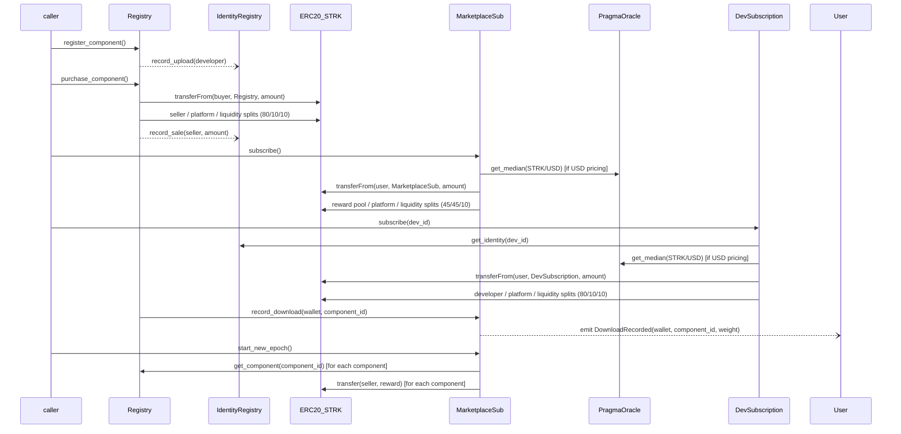

# StarkFlux — Smart-Contract Suite v2

This document describes the **four on-chain contracts** that together form the
StarkFlux marketplace.  
`ComponentRegistry` is the foundation contract and acts as the baseline;  
`IdentityRegistry`, `MarketplaceSubscription`, and `DevSubscription` follow the same patterns, 
creating a cohesive ecosystem with four monetization paths: direct purchases, marketplace-wide subscriptions, 
developer-specific subscriptions, and free components.

---

## 1. ComponentRegistry *(baseline)*

| Item              | Details                                                                            |
|-------------------|------------------------------------------------------------------------------------|
| **Purpose**       | Catalogue components, hold pricing, trigger one-shot purchases, dispatch admin config |
| **Storage (main)**| `components`, `purchases`, fee BPs, oracle address, owner, access_flags for components |
| **External calls**| *Pragma Oracle*, **STRK** ERC-20, **IdentityRegistry** (`record_upload`, `record_sale`), **MarketplaceSubscription** (`record_download`) |
| **Events**        | `ComponentRegistered`, `ComponentPurchased`, `ComponentPriceUpdated` (with access_flags) |
| **Access-control**| `owner_address` with two-step transfer                                             |
| **Fee logic**     | `_handle_payment_distribution` (80/10/10 seller/platform/liquidity split)            |
| **Oracle guard**  | staleness, zero-price, decimals scaling                                            |
| **Error constants**| `ERR_OWNER_ONLY`, `ERR_ALREADY_REGISTERED`, `ERR_PRICE_TOO_LARGE`, …              |
| **Key features**  | Access control via access_flags (bitmask: 1=buy, 2=devSub, 4=marketSub, 8=free), Oracle-based USD pricing |
| **Type Consistency** | Use `u64` for component_id across all storage, events, and function parameters |

---

## 2. IdentityRegistry

| Item                  | Requirement                                                                                                                         |
|-----------------------|-------------------------------------------------------------------------------------------------------------------------------------|
| **Purpose**           | Map each developer address to a unique `identity_id`; track upload count and cumulative STRK sales                                  |
| **Storage**           | ```cairo\nstruct Identity {\n  id: u64,\n  owner: ContractAddress,\n  join_timestamp: u64,\n  upload_count: u64,\n  total_sales_strk: u128\n}\nnext_id: u64\nid_by_owner: Map<ContractAddress,u64>\nidentities: Map<u64,Identity>\n``` |
| **Events**            | `IdentityRegistered{id,owner}` · `UploadRecorded{id}` · `SaleRecorded{id,amount}`                                                   |
| **External API**      | `register()` · `get_identity(id)` · `get_id(owner)` · `record_upload(owner)` · `record_sale(owner,amount)`                           |
| **Access-control**    | `onlyComponentRegistry` guard on both *record_* functions; owner can `set_registry_address`                                         |
| **Error codes**       | `ERR_ALREADY_REGISTERED`, `ERR_NOT_REGISTERED`, `ERR_NOT_COMPONENT_REGISTRY`, `ERR_ZERO_ADDRESS`                                    |
| **Upgrade note**      | All maps keyed by fixed-width ints → painless data migration to future versions                                                     |
| **Type Consistency**  | Use `u64` for identity IDs consistently throughout; use `Map` instead of `LegacyMap` |

---

## 3. MarketplaceSubscription

| Item                  | Requirement                                                                                                                         |
|-----------------------|-------------------------------------------------------------------------------------------------------------------------------------|
| **Purpose**           | Provide **marketplace-wide subscription** with epoch-based reward distribution to component creators                                |
| **Storage**           | ```cairo\nsubscription_expiry: Map::<ContractAddress, u64>,\nweighted_dl: Map::<(u64, u64), u128>, // (epoch, cid)\nseen_this_epoch: Map::<(u64, ContractAddress, u64), bool>, // (epoch, wallet, cid)\nfirst_time: Map::<(ContractAddress, u64), bool>,\nreward_pool_strk: u256,\nsub_fee_cfg: OraclePriceCfg,\nsub_fee_strk: u256\n```   |
| **Config params**     | `strk_token`, `liquidity_vault`, `marketplace_vault`, `component_registry`, `pragma_oracle_address`, `oracle_max_staleness`, `owner` |
| **Events**            | `Subscribed{user,expiry}` · `DownloadRecorded{user,component_id,weight}` · `EpochStarted{epoch_id,start_ts}` · `RewardPaid{component_id,seller,amount,epoch_id}` |
| **External API**      | `subscribe()` · `record_download(wallet,component_id)` · `start_new_epoch()` · `set_subscription_fee(new_fee)` · `set_subscription_fee_usd(price_usd_micros,price_feed_key)` · `is_subscribed(user)` · `get_price_usd()` |
| **Fee logic**         | 45/45/10 split (reward pool/platform/liquidity) using calculate_fee_share                                                           |
| **Oracle integration**| Uses Pragma Oracle for USD-to-STRK conversion with OraclePriceCfg struct and _usd_to_strk helper, ensuring stable USD pricing paid in STRK|
| **Inter-contract**    | • STRK `transferFrom` user → MarketplaceSub then split <br>• `ComponentRegistry.get_component` for reward distribution              |
| **Error codes**       | `ErrOracleDataInvalid`, `ErrClockError`, `ErrOraclePriceStale`, `ErrOraclePriceZero`, `ErrPriceTooLarge`, etc.                     |
| **Access-control**    | Owner-only for setter functions; only registry can call record_download                                                             |
| **Anti-abuse**        | Square-root dampening, new-user bonus (2x), epoch-based distribution                                                                |
| **USD Pricing**       | Subscription fees can be set in USD using Pragma Oracle with proper staleness checks and fallback to fixed STRK pricing             |
| **Type Consistency**  | Use `u64` for component_id in all storage types, events, and function parameters |

---

## 4. DevSubscription

| Item                  | Requirement                                                                                                                         |
|-----------------------|-------------------------------------------------------------------------------------------------------------------------------------|
| **Purpose**           | Provide **developer-specific subscriptions** to access all content from a specific developer                                        |
| **Storage**           | ```cairo\nsubscription_expiry: Map<(u64 /*devId*/, ContractAddress /*user*/), u64>,\ndev_prices: Map<u64 /*devId*/, u256>,\ndev_price_cfg: Map<u64 /*devId*/, OraclePriceCfg>,\nidentity_registry: ContractAddress,\nplatform_treasury: ContractAddress,\n``` |
| **Config params**     | `strk_token`, `liquidity_vault`, `platform_treasury`, `identity_registry`, `owner`, `sub_duration_secs`, `pragma_oracle_address`    |
| **Events**            | `Subscribed{user,dev_id,expiry}` · `PriceSet{dev_id,price}` · `PriceUsdSet{dev_id,price_usd_micros,price_feed_key}`                |
| **External API**      | `subscribe(dev_id)` · `is_subscribed(user,dev_id)` · `set_price(dev_id,price)` · `set_price_usd(dev_id,price_usd_micros,price_feed_key)` · `get_price(dev_id)` · `get_price_usd(dev_id)` |
| **Fee logic**         | 80/10/10 split (developer/platform/liquidity) using _calculate_fee_share                                                           |
| **Oracle integration**| Uses Pragma Oracle for USD-to-STRK conversion with OraclePriceCfg struct and _usd_to_strk helper                                   |
| **Inter-contract**    | • STRK `transferFrom` user → DevSubscription then split <br>• `IdentityRegistry.get_identity` for developer verification            |
| **Error codes**       | `ERR_DEV_ONLY`, `ERR_INVALID_PRICE`, `ErrOracleDataInvalid`, `ErrOraclePriceStale`, etc.                                           |
| **Access-control**    | Developer or contract owner can set prices; public subscribe function                                                               |
| **Type Consistency**  | Use `u64` for dev_id throughout all storage, events, and function parameters |

---

## 5. Shared Utility Modules

| Item                  | Details                                                                                                                         |
|-----------------------|-------------------------------------------------------------------------------------------------------------------------------------|
| **math_utils.cairo**  | Centralized utility functions for safe math operations, type conversions, and Oracle helpers                                      |
| **types.cairo**       | Shared data structures like Component, Pricing, OraclePriceCfg, and AccessFlags                                                   |
| **interfaces.cairo**  | Consistent interface definitions for all contracts with proper parameter types and symmetrical view functions                     |

### OraclePriceCfg Implementation
```cairo
#[derive(Drop, Copy, starknet::Store, Serde)]
struct OraclePriceCfg {
    price_usd_micros: u256,  // Price in USD with 6 decimals
    price_feed_key: felt252, // Pragma Oracle pair ID (e.g., STRK/USD)
}
```

### Oracle USD-to-STRK Conversion
The `_usd_to_strk` function must:
1. Request price data from Pragma Oracle
2. Verify timestamp freshness (reject if stale)
3. Validate price is non-zero
4. Apply correct decimal scaling based on Oracle response
5. Calculate STRK amount from USD price
6. Include proper error handling

---

### Cross-contract flow diagram



### Monetization Paths and Fee Splits

The system now supports four distinct monetization paths:

1. **Direct Purchase (80/10/10)**:
   - One-time payment for component access
   - 80% to component creator
   - 10% to platform
   - 10% to liquidity pool

2. **Marketplace Subscription (45/45/10)**:
   - Global subscription with shared access pool
   - 45% to reward pool (distributed based on downloads)
   - 45% to platform
   - 10% to liquidity pool

3. **Developer Subscription (80/10/10)**:
   - Subscribe to specific developer for all their content
   - 80% to developer
   - 10% to platform
   - 10% to liquidity pool

4. **FREE Components (No Fee)**:
   - Components marked with the FREE flag (8)
   - Zero price required
   - Cannot be combined with other monetization methods
   - Cannot be purchased through purchase_component
   - Easily identifiable through is_free() view function
   - Provides a way to share free content on the platform

### Oracle-Based USD Pricing

All contracts supporting USD pricing MUST implement these components:

1. **Storage**:
   - OraclePriceCfg struct with price_usd_micros and price_feed_key
   - Fallback fixed STRK price when Oracle data unavailable

2. **API**:
   - set_price_usd or set_subscription_fee_usd setter
   - get_price_usd view function for UI display

3. **Implementation**:
   - _usd_to_strk helper function with consistent error handling
   - Dynamic conversion using Pragma Oracle price data
   - Staleness checks (configurable max_staleness)
   - Maximum price validation to prevent exploits
   - Centralized get_oracle_power_of_10 function for decimal handling

4. **Oracle Error Handling**:
   - ErrOracleDataInvalid: Invalid response format
   - ErrOraclePriceStale: Price data older than max_staleness
   - ErrOraclePriceZero: Price returned is zero
   - ErrPriceTooLarge: Calculated price exceeds max safe value

This architecture enables consistent USD price options across the platform, regardless of which subscription type a user chooses, while always collecting payment in STRK tokens.