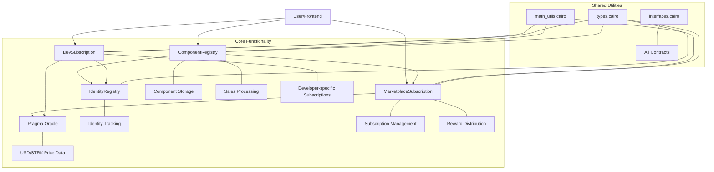
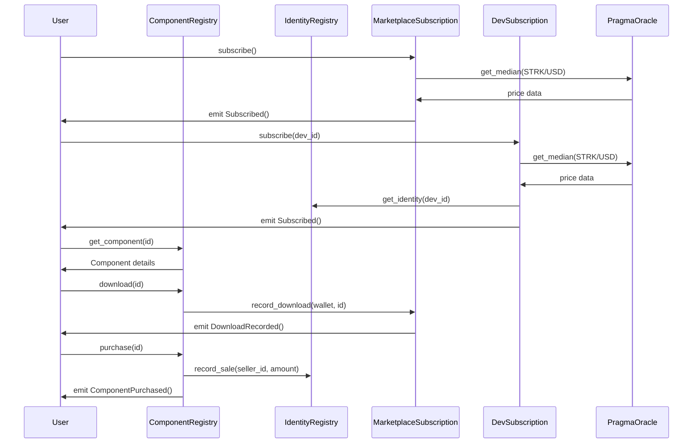
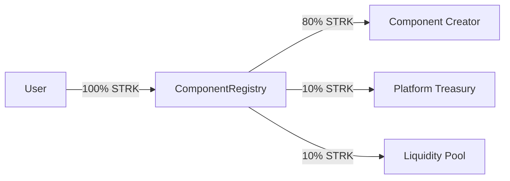
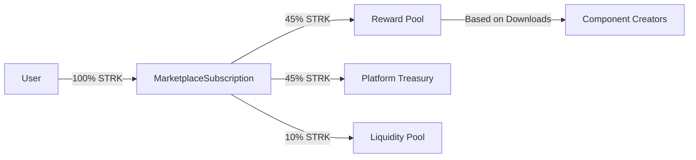
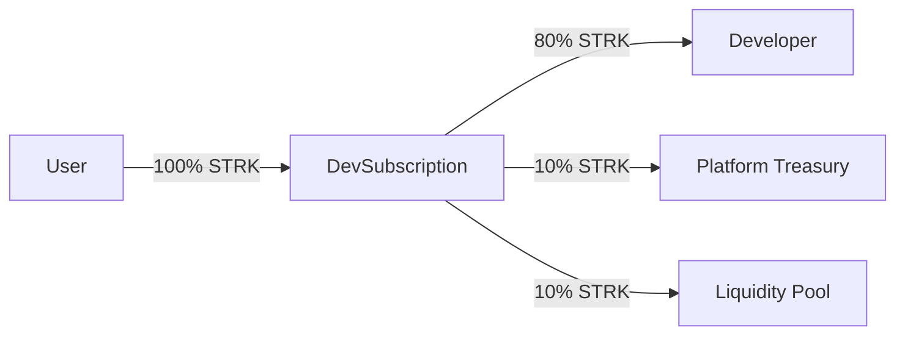
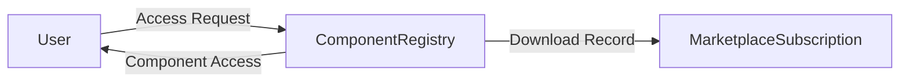
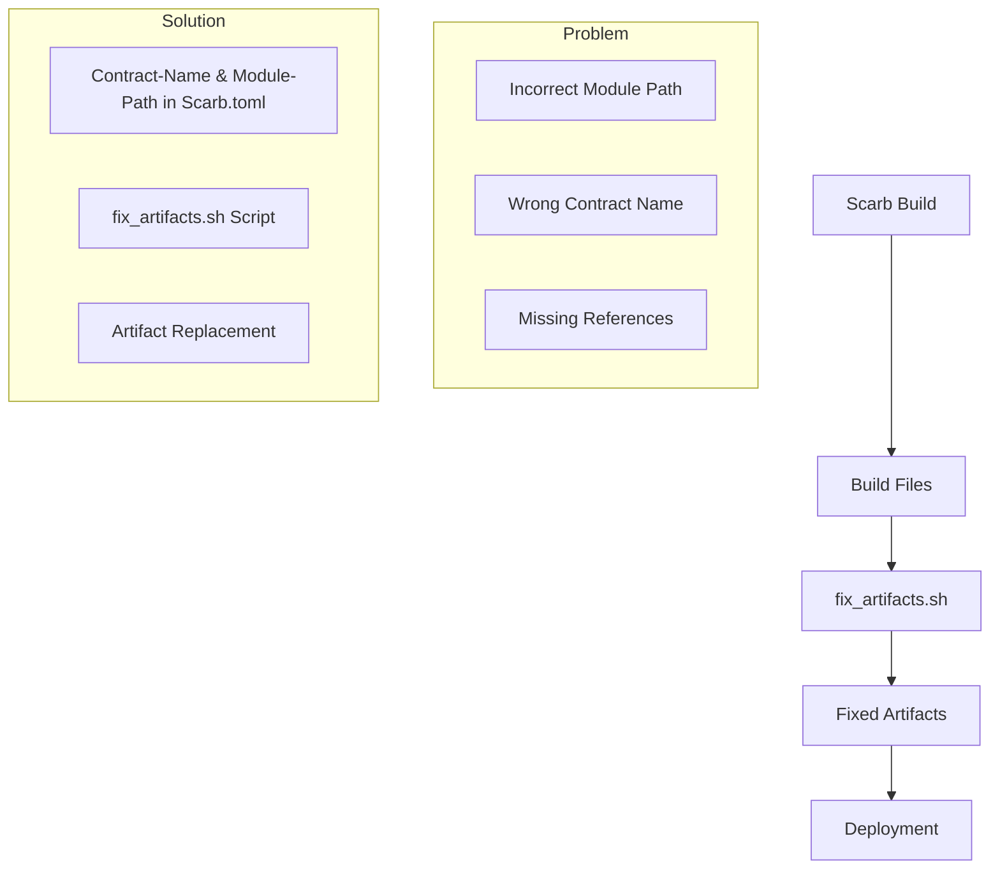
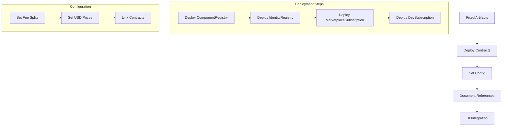
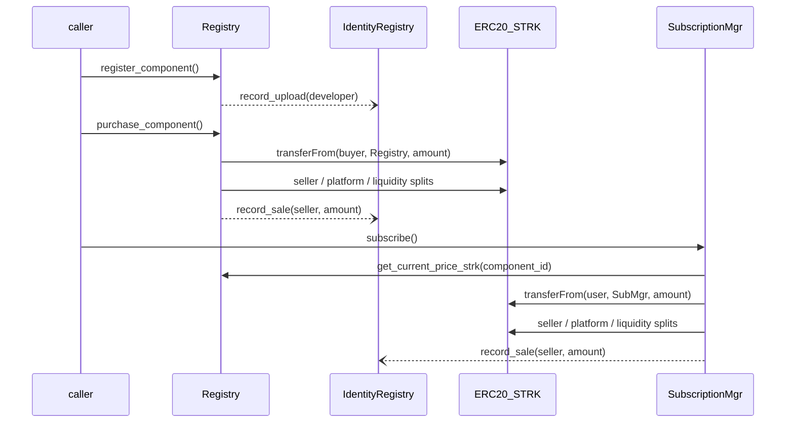

# System Patterns: Starknet Dev-Components Marketplace

This document describes the architectural patterns, component relationships, and key technical decisions for the Starknet Dev-Components Marketplace.

## Developer Profile System Architecture

### Profile Data Management Pattern

The StarkFlux developer profile system follows a three-phase architecture for data persistence and retrieval with enterprise-level privacy protection:

**Phase 1: Enhanced localStorage with Privacy Protection (✅ Current Implementation)**
```typescript
// Wallet-specific storage keys for complete data isolation
const profileKey = `starkflux-profile-${account.address}`;
const profileHistoryKey = `starkflux-profile-history-${account.address}`;
const draftKey = `starkflux-profile-draft-${account.address}`;

// Profile data structure with metadata
interface ProfileSaveData extends ProfileData {
  walletAddress: string;
  lastUpdated: string;
  version: string;
  savedAt?: string; // For history entries
}

// Privacy-protected storage with automatic cleanup
localStorage.setItem(profileKey, JSON.stringify(profileSaveData));

// Automatic data clearing on wallet disconnect
useEffect(() => {
  if (!isConnected || !account) {
    setProfileData(emptyProfileState);
    return;
  }
  // Load wallet-specific data only when connected
  const savedProfile = loadProfile();
  if (savedProfile) setProfileData(savedProfile);
}, [account, isConnected]);
```

**Phase 2: IPFS Integration (🔄 Ready for Implementation)**
```typescript
// Profile picture upload to IPFS
const uploadProfilePicture = async (file: File): Promise<string> => {
  const ipfsHash = await ipfs.add(file);
  return `ipfs://${ipfsHash}`;
};

// Complete profile data to IPFS
const uploadProfileToIPFS = async (profileData: ProfileData): Promise<string> => {
  const profileJson = JSON.stringify(profileData);
  const ipfsHash = await ipfs.add(profileJson);
  return ipfsHash;
};
```

**Phase 3: Smart Contract Storage (⏳ Future)**
```typescript
// Store IPFS hash in IdentityRegistry
const updateDeveloperProfile = async (walletAddress: string, ipfsHash: string) => {
  await identityRegistry.update_profile(walletAddress, ipfsHash);
};

// Retrieve profile from IPFS using on-chain hash
const loadDeveloperProfile = async (walletAddress: string): Promise<ProfileData> => {
  const ipfsHash = await identityRegistry.get_profile_hash(walletAddress);
  const profileData = await ipfs.get(ipfsHash);
  return JSON.parse(profileData);
};
```

### Profile Validation Pattern

Comprehensive client-side validation before save operations:

```typescript
const validateProfile = (profileData: ProfileData): ValidationResult => {
  const errors: Partial<ProfileData> = {};
  
  // Required fields validation
  if (!profileData.displayName.trim()) errors.displayName = 'Display name is required';
  if (!profileData.username.trim()) errors.username = 'Username is required';
  if (!profileData.bio.trim()) errors.bio = 'Bio is required';
  
  // Format validation
  if (!/^[a-zA-Z0-9_-]+$/.test(profileData.username)) {
    errors.username = 'Username can only contain letters, numbers, hyphens, and underscores';
  }
  
  // Length validation
  if (profileData.bio.length > 500) errors.bio = 'Bio must be 500 characters or less';
  
  // URL validation for social links
  const urlFields = ['githubUrl', 'linkedinUrl', 'twitterUrl', 'personalWebsite'];
  urlFields.forEach(field => {
    const url = profileData[field as keyof ProfileData] as string;
    if (url && !isValidUrl(url)) {
      errors[field as keyof ProfileData] = `Please enter a valid ${field.replace('Url', '')} URL`;
    }
  });
  
  return { isValid: Object.keys(errors).length === 0, errors };
};
```

### Skills Management Pattern

Interactive skills system with autocomplete and validation:

```typescript
// Predefined skills for autocomplete
const SUGGESTED_SKILLS = [
  'React', 'TypeScript', 'JavaScript', 'Node.js', 'Python', 'Rust', 'Cairo',
  'Solidity', 'Smart Contracts', 'Web3', 'Blockchain', 'DeFi', 'NFTs',
  'Starknet', 'Ethereum', 'Frontend Development', 'Backend Development'
];

// Skills validation and management
const addSkill = (skill: string, currentSkills: string[], maxSkills: number = 15) => {
  const trimmedSkill = skill.trim();
  
  if (!trimmedSkill) return { success: false, error: 'Skill cannot be empty' };
  if (currentSkills.length >= maxSkills) return { success: false, error: `Maximum ${maxSkills} skills allowed` };
  if (currentSkills.includes(trimmedSkill)) return { success: false, error: 'Skill already added' };
  
  return { success: true, skills: [...currentSkills, trimmedSkill] };
};
```

### Profile Picture Upload Pattern

Drag & drop image upload with validation and preview:

```typescript
const handleFileSelect = async (file: File) => {
  // Validation
  if (!file.type.startsWith('image/')) {
    throw new Error('Please select an image file (JPG, PNG, WebP, etc.)');
  }
  if (file.size > 5 * 1024 * 1024) {
    throw new Error('Please select an image smaller than 5MB');
  }
  
  // Phase 1: Base64 conversion for preview
  const reader = new FileReader();
  reader.onload = (e) => {
    const result = e.target?.result as string;
    onImageChange(result);
  };
  reader.readAsDataURL(file);
  
  // Phase 2: IPFS upload (future)
  // const ipfsHash = await uploadToIPFS(file);
  // onImageChange(`ipfs://${ipfsHash}`);
};
```

### Real-time Preview Pattern

Live preview updates as user types in the form:

```typescript
// Profile data state management
const [profileData, setProfileData] = useState<ProfileData>(initialState);

// Handle field changes with immediate preview update
const handleProfileChange = (field: keyof ProfileData, value: string | string[]) => {
  setProfileData(prev => ({ ...prev, [field]: value }));
  
  // Clear validation error for this field
  if (validationErrors[field]) {
    setValidationErrors(prev => ({ ...prev, [field]: undefined }));
  }
};

// Auto-save drafts with debouncing
useEffect(() => {
  const timeoutId = setTimeout(() => {
    localStorage.setItem('starkflux-profile-draft', JSON.stringify(profileData));
  }, 1000);
  return () => clearTimeout(timeoutId);
}, [profileData]);
```

### Privacy Protection Pattern

Enterprise-level privacy protection ensuring complete wallet-based data isolation:

```typescript
// Privacy-First Storage Architecture
class WalletSpecificStorage {
  private getStorageKey(walletAddress: string, type: 'profile' | 'history' | 'draft'): string {
    return `starkflux-${type}-${walletAddress}`;
  }
  
  // Save data only for connected wallet
  saveProfile(walletAddress: string, profileData: ProfileData): void {
    if (!walletAddress) throw new Error('Wallet address required for privacy protection');
    
    const key = this.getStorageKey(walletAddress, 'profile');
    const dataWithMetadata = {
      ...profileData,
      walletAddress,
      lastUpdated: new Date().toISOString(),
      version: '1.0'
    };
    
    localStorage.setItem(key, JSON.stringify(dataWithMetadata));
  }
  
  // Load data only for connected wallet
  loadProfile(walletAddress: string): ProfileData | null {
    if (!walletAddress) return null;
    
    const key = this.getStorageKey(walletAddress, 'profile');
    const saved = localStorage.getItem(key);
    return saved ? JSON.parse(saved) : null;
  }
  
  // Clear all data for specific wallet
  clearWalletData(walletAddress: string): void {
    ['profile', 'history', 'draft'].forEach(type => {
      const key = this.getStorageKey(walletAddress, type);
      localStorage.removeItem(key);
    });
  }
}

// Component-level privacy enforcement
const usePrivacyProtectedProfile = () => {
  const { account, isConnected } = useWallet();
  const [profileData, setProfileData] = useState<ProfileData>(emptyState);
  
  // Automatic cleanup on wallet disconnect
  useEffect(() => {
    if (!isConnected || !account) {
      setProfileData(emptyState);
      return;
    }
    
    // Load data only when wallet is connected
    const storage = new WalletSpecificStorage();
    const savedProfile = storage.loadProfile(account.address);
    if (savedProfile) setProfileData(savedProfile);
  }, [account, isConnected]);
  
  return { profileData, setProfileData };
};
```

### Production Readiness Pattern

Clean, production-ready codebase with professional navigation and debug-free implementation:

```typescript
// Navigation Enhancement Pattern
const ProductionHeader = () => {
  return (
    <nav>
      <NavLink to="/">Home</NavLink>
      <NavLink to="/profile">Dev Profile</NavLink>  {/* Professional labeling */}
      <NavLink to="/upload">Upload</NavLink>
      <WalletConnectButton />
    </nav>
  );
};

// Debug-Free Component Pattern
const ProductionComponent = () => {
  // ❌ Removed: Debug utilities, verification functions, test buttons
  // ✅ Kept: Core functionality, error handling, user feedback
  
  const { registerDeveloper, isRegistering, registrationError } = useRegisterDeveloper();
  
  // Clean error handling without debug overhead
  const handleRegister = async () => {
    try {
      await registerDeveloper();
      toast({ title: "Registration Successful!", status: "success" });
    } catch (error) {
      toast({ title: "Registration Failed", status: "error" });
    }
  };
  
  return (
    <Button onClick={handleRegister} isLoading={isRegistering}>
      Register as Developer
    </Button>
  );
};

// Code Quality Standards
const codeQualityChecklist = {
  imports: "✅ Clean imports, no unused references",
  state: "✅ Minimal state, no debug variables",
  functions: "✅ Production functions only, no debug handlers",
  ui: "✅ User-focused interface, no development tools",
  performance: "✅ Optimized rendering, no debug overhead",
  typescript: "✅ Proper typing, no any types",
  errors: "✅ User-friendly error messages, no debug logs"
};
```

### Migration and Cleanup Pattern

Safe migration from development to production with automatic cleanup:

```typescript
// Legacy Data Migration Pattern
const useLegacyDataMigration = () => {
  const cleanupGlobalDraft = useCallback(() => {
    // Remove old global draft data (one-time cleanup)
    localStorage.removeItem('starkflux-profile-draft');
    
    // Could also migrate existing data to wallet-specific format
    const legacyData = localStorage.getItem('legacy-profile-data');
    if (legacyData && account?.address) {
      const newKey = `starkflux-profile-${account.address}`;
      localStorage.setItem(newKey, legacyData);
      localStorage.removeItem('legacy-profile-data');
    }
  }, [account]);
  
  // Run migration once on component mount
  useEffect(() => {
    cleanupGlobalDraft();
  }, [cleanupGlobalDraft]);
};

// Development to Production Transition Checklist
const productionReadinessChecklist = {
  privacy: "✅ Wallet-specific data isolation implemented",
  navigation: "✅ Professional header with intuitive labeling",
  debugging: "✅ All debug utilities and UI elements removed",
  codeQuality: "✅ Clean imports, optimized state management",
  userExperience: "✅ Focused interface, clear error handling",
  performance: "✅ No debug overhead, efficient rendering",
  security: "✅ No data leakage between wallet sessions",
  migration: "✅ Automatic cleanup of legacy development data"
};
```

## UI Contract Integration Patterns

The StarkFlux UI has established patterns for integrating with the deployed smart contracts, with a developer registration verification system successfully implemented as proof of concept.

### Layered Architecture Pattern (In Development)
```mermaid
graph TD
    ABI[Contract ABIs] --> Hooks[React Hooks]
    Hooks --> Utils[Data Formatting Utilities]
    Hooks --> Components[UI Components]
    Components --> Pages[Application Pages]
    
    subgraph ABI Layer - ✅ Configured
        ContractAddresses[v1.2.0 Contract Addresses]
        ABIDefinitions[Contract ABI Definitions]
        TypeScriptTypes[TypeScript Type Support]
    end
    
    subgraph Hook Layer - 🔄 In Development
        ComponentRegistry[useComponentRegistry]
        IdentityRegistry[useIdentityRegistry]
        MarketplaceSub[useMarketplaceSubscription]
        DevSub[useDevSubscription]
        AccessVerification[useAccessVerification]
        TransactionStatus[useTransactionStatus]
    end
    
    subgraph Utility Layer - ✅ Built
        FormatSTRK[formatStrkPrice]
        FormatFlags[formatAccessFlags]
        FormatTime[formatTimestamp]
        Validation[componentValidation]
    end
    
    subgraph Verification System - ✅ Complete
        RegistrationCheck[Developer Registration Check]
        IDRetrieval[Developer ID Retrieval]
        StatusDisplay[Registration Status Display]
    end
```

### Established Integration Patterns

The developer registration verification system has established proven patterns for blockchain interaction:

#### 1. Transaction Lifecycle Pattern
```typescript
// Proven pattern for handling blockchain transactions
const useContractTransaction = () => {
  const [txHash, setTxHash] = useState<string | null>(null);
  const [status, setStatus] = useState<'idle' | 'pending' | 'success' | 'error'>('idle');
  
  const execute = async (contractCall: () => Promise<any>) => {
    setStatus('pending');
    try {
      const tx = await contractCall();
      setTxHash(tx.transaction_hash);
      
      // Monitor confirmation
      const confirmed = await waitForConfirmation(tx.transaction_hash);
      setStatus('success');
      return confirmed;
    } catch (error) {
      setStatus('error');
      throw error;
    }
  };
  
  return { execute, txHash, status };
};
```

#### 2. Developer Registration Pattern (Verified Working)
```typescript
// Successfully implemented and tested pattern for developer registration checks
const useDeveloperRegistration = () => {
  const { account } = useWallet();
  const [needsRegistration, setNeedsRegistration] = useState(false);
  const [isRegistered, setIsRegistered] = useState(false);
  
  useEffect(() => {
    const checkRegistration = async () => {
      if (!account) return;
      
      const contract = new Contract(
        IDENTITY_REGISTRY_ABI,
        CONTRACT_ADDRESSES.IDENTITY_REGISTRY,
        account
      );
      
      try {
        const id = await contract.call('get_id', [account.address]);
        setIsRegistered(id > 0);
        setNeedsRegistration(id === 0);
      } catch (error) {
        setNeedsRegistration(true);
      }
    };
    
    checkRegistration();
  }, [account]);
  
  return { needsRegistration, isRegistered };
};
```

This pattern has been verified with actual wallet registration:
- **Test Wallet**: `0x07458d134151De3fFb903eAf6F9ba7Fd7712d89215B9cCa4Fac5539A4C1d2351`
- **Transaction**: `0x63a324b944de63cffab576f07ff43056cd2e4f0a297076c1dcb49ba2798411a`
- **Result**: Successfully detected as registered developer

#### 3. Form-to-Contract Integration Pattern (Pattern Established)
```typescript
// Pattern established for connecting forms to contracts
const useRegisterComponent = () => {
  const { account } = useWallet();
  const { execute, txHash, status } = useContractTransaction();
  
  const register = async (componentData: ComponentFormData) => {
    const contract = new Contract(
      COMPONENT_REGISTRY_ABI,
      CONTRACT_ADDRESSES.COMPONENT_REGISTRY,
      account
    );
    
    // Format data for contract
    const calldata = [
      shortString.encodeShortString(componentData.title),
      shortString.encodeShortString(componentData.reference),
      cairo.uint256(componentData.price || 0),
      componentData.accessFlags,
      componentData.oraclePriceFeedKey || '0x0'
    ];
    
    return execute(() => 
      contract.invoke('register_component', calldata)
    );
  };
  
  return { register, txHash, status };
};
```

#### 4. Real-time Transaction Monitoring Pattern (Pattern Established)
```typescript
// Pattern for transaction status tracking
const useTransactionStatus = (txHash: string | null) => {
  const [status, setStatus] = useState<TransactionStatus>('pending');
  const [confirmations, setConfirmations] = useState(0);
  
  useEffect(() => {
    if (!txHash) return;
    
    const interval = setInterval(async () => {
      const provider = new RpcProvider({ nodeUrl: SEPOLIA_RPC_URL });
      const receipt = await provider.getTransactionReceipt(txHash);
      
      if (receipt.status === 'ACCEPTED_ON_L2') {
        setStatus('confirmed');
        clearInterval(interval);
      } else if (receipt.status === 'REJECTED') {
        setStatus('failed');
        clearInterval(interval);
      }
      
      // Update confirmation count
      const currentBlock = await provider.getBlockNumber();
      setConfirmations(currentBlock - receipt.block_number);
    }, 5000);
    
    return () => clearInterval(interval);
  }, [txHash]);
  
  return { status, confirmations };
};
```

### Development Status

The implementation is progressing with key milestones achieved:

1. **Phase 1: Foundation** ✅
   - Core UI components built
   - Contract ABIs configured
   - TypeScript support established

2. **Phase 2: Verification System** ✅
   - Developer registration checking implemented
   - Transaction verification working
   - Successfully tested with real wallet

3. **Phase 3: Full Marketplace Integration** 🔄
   - Component browsing interface (In Progress)
   - Purchase workflows (Planned)
   - Subscription management (Planned)
   - Developer dashboard (Planned)

The verification system proves the integration patterns work correctly with the deployed contracts. These patterns will be extended to implement the complete marketplace functionality.

### Mock-to-Real Transition Strategy

The implementation is following a phased approach for transitioning from mock data to real blockchain interaction:

1. **Phase 1: Mock Implementation** ✅
   - Developed UI components with mock data
   - Established hook interfaces and patterns
   - Created test scenarios for different use cases

2. **Phase 2: Verification System** ✅
   - Built developer registration verification as proof of concept
   - Successfully tested with real wallet and transaction
   - Validated integration patterns work correctly

3. **Phase 3: Full Integration** 🔄 (In Progress)
   - Extending patterns to all contract interactions
   - Building complete marketplace functionality
   - Implementing purchase and subscription workflows

This phased approach allows parallel development of UI and blockchain integration while validating each integration pattern before full implementation.

### Hook Implementation Pattern
Each contract interaction is encapsulated in a React hook that:
1. Provides a consistent API regardless of implementation (mock or real)
2. Includes loading and error states for all operations
3. Exposes functions that match the contract's functionality
4. Provides proper TypeScript typings matching contract structures

Example pattern:
```typescript
export const useComponentRegistry = () => {
  const [loading, setLoading] = useState(false);
  const [error, setError] = useState<string | null>(null);

  // Contract data retrieval functions
  const getComponent = (componentId: number) => {
    // Implementation (mock or real)
  };

  // Additional utility functions
  const isFree = (componentId: number) => {
    // Implementation
  };

  return {
    getComponent,
    isFree,
    loading,
    error
  };
};
```

### Access Verification Pattern
Component access rights are determined using a composite hook that:
1. Combines data from multiple sources:
   - Direct purchase records
   - Marketplace subscription status
   - Developer subscription status
   - FREE component status
2. Returns comprehensive access information:
   - Overall access (boolean)
   - Access type-specific flags
   - Loading and error states

```typescript
export const useAccessVerification = (componentId: number, userAddress?: string) => {
  // Get data from various contracts
  const { getComponent, isFree } = useComponentRegistry();
  const { isSubscribed: isDevSubscribed } = useDevSubscription();
  const { isSubscribed: isMarketplaceSubscribed } = useMarketplaceSubscription();

  // Purchase verification (from mock or contract)
  const hasPurchased = verifyPurchase(componentId, userAddress);

  // Component access flags
  const component = getComponent(componentId);
  const hasBuyAccess = hasPurchased && !!(component?.access_flags & 1);
  const hasDevSubAccess = !!(component?.access_flags & 2) && isDevSubscribed(userAddress, component.seller_id);
  const hasMarketSubAccess = !!(component?.access_flags & 4) && isMarketplaceSubscribed(userAddress);
  const hasFreeAccess = !!(component?.access_flags & 8);

  // Overall access determination
  const hasAccess = hasBuyAccess || hasDevSubAccess || hasMarketSubAccess || hasFreeAccess;

  return {
    hasAccess,
    hasBuyAccess,
    hasDevSubAccess, 
    hasMarketSubAccess,
    hasFreeAccess,
    loading,
    error
  };
};
```

### Contract Data Formatting Pattern
Contract values are formatted using dedicated utility functions:
1. `formatStrkPrice`: Converts wei values to user-friendly STRK amounts
2. `formatAccessFlags`: Converts numeric flag bitmasks to readable strings
3. `formatTimestamp`: Converts Unix timestamps to readable dates

This ensures consistent data presentation throughout the UI and centralizes formatting logic.

## 1. System Architecture

The marketplace is built around three primary smart contracts:

1. **ComponentRegistry**: Core registry for components, handles purchases, metadata, and identities
2. **IdentityRegistry**: Tracks developer identities and metrics
3. **MarketplaceSubscription**: Manages marketplace-wide subscriptions and reward distribution
4. **DevSubscription**: Manages developer-specific subscriptions

These contracts interact to create a comprehensive developer components marketplace with three monetization paths: one-off purchases, marketplace subscriptions, and developer subscriptions. The system also integrates with Pragma Oracle for USD price stability.

### Contract Relationships



### Data Flow



### Token Flow

**One-off Purchases (80/10/10 split)** - Verified:


**Marketplace Subscription Model (45/45/10 split)** - Verified:


**Developer Subscription Model (80/10/10 split)** - Verified:


**FREE Components (No Token Flow)** - Verified:


## 2. Key System Components

### ComponentRegistry
Central contract for the marketplace, responsible for:
- Component registration and metadata storage
- Purchase processing with fee splitting (80/10/10, verified)
- Integration with IdentityRegistry
- Download tracking via MarketplaceSubscription
- Access control with four validated flags (BUY=1, DEV_SUB=2, MKT_SUB=4, FREE=8)
- Support for FREE components with zero price enforcement
- Verified artifact generation for proper deployment

### IdentityRegistry
Manages developer identities:
- Tracks developer uploads and sales
- Records metrics for marketplace analytics
- Provides identity verification
- Verified artifact generation for proper deployment

### MarketplaceSubscription
Manages marketplace-wide subscriptions:
- Tracks user subscription expiry with proper renewal logic (max(now, expiry) + epoch_length)
- Records component downloads with weighted metrics using optimized storage patterns
- Implements epoch-based reward distribution using anti-abuse mechanisms
- Uses a two-pass algorithm with square-root dampening for fair reward distribution
- Supports both fixed STRK prices and Oracle-based USD prices
- Uses verified 45/45/10 fee split (reward pool / platform / liquidity)
- Emits detailed events for subscriptions, downloads, and reward payments
- Verified artifact generation for proper deployment

### DevSubscription
Manages developer-specific subscriptions:
- Tracks user-developer subscription pairs with expiry timestamps
- Uses verified 80/10/10 fee split model (developer/platform/liquidity)
- Validates developer identity via IdentityRegistry
- Offers both fixed STRK prices and Oracle-based USD prices
- Provides subscription verification via is_subscribed function
- Emits events for subscriptions and price changes
- Verified artifact generation for proper deployment

## 3. Build and Deployment Patterns

### Artifact Management Pattern
The project uses a verified custom build artifact management pattern to ensure correct contract references:



**Issue**: By default, Scarb generates artifacts that all reference the same contract name and module path, making deployment difficult.

**Solution**:
1. Add explicit contract-name and module-path entries to Scarb.toml
2. Create fix_artifacts.sh script that:
   - Builds the contracts
   - Generates correct artifact files for each contract
   - Renames compiled files to match
3. Use fixed artifacts for deployment

This pattern has been verified through testing and ensures each contract's starknet_artifacts.json correctly references its own module path rather than defaulting to MarketplaceSubscription.

### Version Control Pattern

The project utilizes GitHub for version control, with a structured repository organization:

```mermaid
graph TD
    Root[Repository Root] --> SRC[src/]
    Root --> Scripts[scripts/]
    Root --> Tests[tests/]
    Root --> Docs[docs/]
    Root --> Build[Scarb.toml, README.md, LICENSE]
    
    SRC --> Contracts[Cairo Contracts]
    SRC --> Utils[Utility Modules]
    SRC --> Interfaces[Interface Definitions]
    
    Scripts --> BuildScripts[fix_artifacts.sh]
    Scripts --> DeployScripts[deploy.sh (future)]
    
    Tests --> UnitTests[Contract Tests]
    Tests --> Mocks[Test Helpers]
    
    Docs --> Requirements[Requirements Docs]
    Docs --> GuideFiles[Integration Guides]
```

**Repository Structure**:
1. GitHub Repository: github.com/dragonsarealive/starknet-dev-components-marketplace
2. Key Elements:
   - Source code in src/ directory (contracts, interfaces, utilities)
   - Build and deployment scripts in scripts/ directory
   - Documentation in docs/ directory
   - Test files in tests/ directory
   - Project configuration in root (Scarb.toml, README.md, LICENSE)
3. Benefits:
   - Clear organization for contributors
   - Separation of concerns between code, tests, and documentation
   - Proper versioning of all project artifacts
   - Open-source distribution with MIT license

The repository serves as the definitive source of truth for the project, with all production-ready code maintained in the main branch.

### Deployment Process
The contracts are now verified and ready for production testnet deployment:



The deployment process will follow this sequence:
1. Generate correct artifacts using fix_artifacts.sh
2. Deploy core contracts in proper order
3. Set configuration parameters (fee splits, USD prices)
4. Link contracts together
5. Document deployed addresses for frontend integration

## 4. Design Patterns in Use

### Access Control
- Owner-based access for admin functions
- Contract-level access controls for inter-contract calls
- Registry-only access for critical functions
- Developer-only access for price setting

### Event-Driven Architecture
- Events emitted for all state changes
- Comprehensive event system for frontend integration
- Subscription, download, and reward payment events for analytics and transparency

### Anti-Abuse Mechanisms
- Square-root dampening in reward distribution
- First-time interaction bonus to incentivize discovery
- Epoch-based distributions to prevent timing attacks

### Fee Splitting
- One-off purchases: 80/10/10 (developer/platform/liquidity)
- Marketplace subscription: 45/45/10 (reward pool/platform/liquidity)
- Developer subscription: 80/10/10 (developer/platform/liquidity)

### Storage Optimization
- Map-based storage for scalable data structures
- Consistent key ordering in maps for predictable access patterns 
- Efficient tracking of user-component interactions with (epoch, wallet, component_id) tuples
- Minimal per-download storage overhead

### Price Stability (Oracle-Based)
- Support for both STRK and USD pricing models
- OraclePriceCfg struct to store USD price and Oracle feed key
- Dynamic USD-to-STRK conversion using Pragma Oracle
- Staleness and validity checks for Oracle data
- Fallback to fixed STRK pricing when Oracle is unavailable
- Clear price configuration API with validation

## 5. Key Technical Decisions

### 1. Dual Pricing Model Implementation

**Decision**: Support both fixed STRK pricing and dynamic Oracle-based USD pricing for all subscription types.

**Implementation**:
- Created OraclePriceCfg struct to store USD price and Oracle feed key
- Implemented _usd_to_strk helper function for dynamic price conversion
- Added set_subscription_fee_usd and set_price_usd setter functions
- Updated get_price functions to handle both pricing models
- Added get_price_usd view function for UI display
- Integrated with Pragma Oracle with validation and staleness checks

**Benefits**:
- Price stability for users (set in familiar USD)
- Protection against STRK token volatility
- Transparent pricing for both contract and UI
- Flexibility for developers to choose pricing model
- Fallback mechanism when Oracle is unavailable
- Consistent implementation across both subscription contracts

### 2. Subscription Model Implementation 

**Decision**: Implement marketplace-wide subscription with usage-based rewards rather than per-component subscriptions.

**Implementation**: 
- Built MarketplaceSubscription contract with:
  - User-level expiry tracking via `subscription_expiry` map
  - Download metrics via `weighted_dl` and related maps with optimized key ordering
  - Epoch-based reward distribution with configurable epoch length
  - Square-root dampening in reward calculation for anti-abuse
  - First-time interaction bonus to incentivize discovery
  - Two-pass distribution algorithm for fairness
  - Component IDs as u128 for consistency with ComponentRegistry
  - Safe u256 math operations using helper functions

**Benefits**:
- Lower friction for users (single subscription)
- Better incentives for developers (rewards based on actual usage)
- More sustainable economics (pooled subscription fees)
- Built-in anti-abuse mechanisms
- Consistent type usage across the contract system

### 3. Developer Subscription Implementation

**Decision**: Implement developer-specific subscriptions alongside marketplace-wide subscriptions.

**Implementation**:
- Created DevSubscription contract with:
  - User-developer subscription tracking with expiry timestamps
  - Developer-controlled pricing (both STRK and USD)
  - Integration with IdentityRegistry for developer verification
  - 80/10/10 fee split model for consistency with marketplace
  - Subscription verification via is_subscribed function
  - Events for subscriptions and price changes

**Benefits**:
- Direct monetization path for popular developers
- User flexibility (subscribe to specific developers or whole marketplace)
- Developer control over pricing and revenue
- Consistent economics across subscription types
- Simple verification for access control

### 4. Registry-Identity Separation

**Decision**: Separate component registry and identity functionality into distinct contracts.

**Implementation**: Created IdentityRegistry for developer identity management, linked to ComponentRegistry.

**Benefits**:
- Cleaner code separation
- Potential for identity reuse across different marketplaces
- Better scalability for future features

### 5. Fee Split Model

**Decision**: Use different fee splits for one-off purchases vs. subscriptions.

**Implementation**:
- One-off purchases: 80/10/10 (developer/platform/liquidity)
- Marketplace subscription: 45/45/10 (reward pool/platform/liquidity)
- Developer subscription: 80/10/10 (developer/platform/liquidity)

**Benefits**:
- Higher developer portion for direct sales and developer subscriptions (80%)
- Sustainable platform economics for marketplace subscriptions (45/45/10)
- Liquidity incentive consistently applied across all models (10%)
- Balanced reward mechanism in marketplace subscription model

## 6. Component Relationships

### MarketplaceSubscription Integration

The MarketplaceSubscription contract integrates with the ComponentRegistry in the following ways:

1. **Download Recording**:
   - ComponentRegistry calls `record_download(wallet, component_id)` on MarketplaceSubscription
   - MarketplaceSubscription tracks this data for reward distribution using optimized storage patterns

2. **Subscription Verification**:
   - ComponentRegistry can verify subscription status via `is_subscribed(wallet)` to gate certain features

3. **Reward Distribution**:
   - MarketplaceSubscription distributes rewards to component creators at the end of each epoch
   - Uses component data from ComponentRegistry for seller addresses
   - Emits RewardPaid events for each reward distributed

### Identity Management Flow

1. ComponentRegistry creates/manages components
2. IdentityRegistry tracks developer metrics
3. MarketplaceSubscription records download metrics
4. End of epoch: rewards distributed to component creators

## 7. Future Expansion Points

1. **Tiered Subscriptions**: Framework supports future addition of tiered subscription levels
2. **Enhanced Analytics**: Download and usage metrics provide foundation for analytics
3. **Reputation System**: Identity metrics can evolve into reputation system
4. **Enhanced Anti-Abuse**: Current system can be extended with more advanced mechanisms
5. **Governance**: Treasury accumulation creates opportunity for governance

## 8. Security Considerations

1. **Access Control**: Strict access control between contracts
2. **Input Validation**: Comprehensive checks on all inputs
3. **Economic Design**: Fee splits designed for sustainability
4. **Overflow Protection**: Safe math for all arithmetic operations
5. **Two-Pass Algorithm**: Prevents division rounding errors in reward distribution
6. **Epoch Grace Period**: Prevents timing attacks

## 9. Key Inter-Contract Dependencies & Interactions

The following diagram (from `smartContractsReqs.md`) illustrates the primary flows:


*   **`ComponentRegistry` → `IdentityRegistry`**:
    *   On `register_component(developer: ...)`: `ComponentRegistry` calls `IdentityRegistry.record_upload(owner: developer)`.
    *   On `purchase_component()` leading to a sale for `seller`: `ComponentRegistry` calls `IdentityRegistry.record_sale(owner: seller, amount: sale_amount_strk)`.
*   **`SubscriptionManager` → `ComponentRegistry`**:
    *   On `subscribe(component_id, ...)` or `renew(component_id, ...)`: `SubscriptionManager` calls `ComponentRegistry.get_component(component_id)` to fetch the component and check eligibility and `ComponentRegistry.get_current_price_strk(component_id)` to fetch the current price.
*   **`SubscriptionManager` → `IdentityRegistry`**:
    *   After a successful subscription payment that involves a component seller: `SubscriptionManager` calls `IdentityRegistry.record_sale(owner: seller, amount: seller_share_strk)`.
*   **All Contracts → `IERC20` (STRK Token)**:
    *   `ComponentRegistry` interacts with the STRK token contract for `transferFrom` (from buyer) and `transfer` (to seller, platform, liquidity), relying on the OpenZeppelin-style revert-on-failure semantics.
    *   `SubscriptionManager` interacts similarly for subscription fees and distributions.
*   **`ComponentRegistry` → `IPragmaOracle`**:
    *   For components priced in USD, `ComponentRegistry` calls `IPragmaOracle.get_median(pair_id: ...)` to fetch the exchange rate.

## 10. Shared Code Modules (within `src/`)

*   **`src/interfaces.cairo`**: Serves as a central repository for shared types and interfaces:
    *   **Interface Traits** (with generics for proper contract state handling):
        *   `IERC20<TContractState>`
        *   `IPragmaOracle<TContractState>`
        *   `IUniversalIdentityRegistry<TContractState>` (for `ComponentRegistry` and `SubscriptionManager` to call `IdentityRegistry`)
        *   `IComponentRegistryExternal<TContractState>` (for `SubscriptionManager` to call `ComponentRegistry`)
        *   `ISubscriptionManager<TContractState>` (for external contracts to call `SubscriptionManager`)
    *   **Shared Structs**:
        *   `Identity` - Used by IdentityRegistry to track developer information
        *   `Subscription` - Used by SubscriptionManager to track subscription details
        *   By centralizing these struct definitions in interfaces.cairo, we avoid duplication and ensure consistent type usage across contracts

*   **`src/types.cairo`**: Defines shared data structures like `Component`, `Pricing` (used by Registry).

*   **`src/math_utils.cairo`**: Contains shared utility functions, especially for safe u256 arithmetic (`u256_safe_mul`, `u256_safe_div`, `calculate_percentage`, `pow10_u256`). Verified to correctly handle overflow by using u256 internally.

*   **`src/lib.cairo`**: Serves as the module declaration file, importing and re-exporting the necessary modules:
    *   Declares shared utility and interface modules
    *   No longer contains declarations for contract modules that are targets in Scarb.toml (component_registry, identity_registry, subscription_manager)
    *   This separation ensures clean module imports and avoids duplicate definitions

## 11. Common Design Patterns & Features

*   **Ownership Pattern**: All three contracts (`ComponentRegistry`, `IdentityRegistry`, `SubscriptionManager`) implement a two-step ownership transfer mechanism (`transfer_ownership` followed by `accept_ownership`) or straight-forward owner checks with `_only_owner()`.
*   **Owner Synchronization**: `SubscriptionManager` implements an owner-sync guard in `accept_ownership` that verifies the new owner matches the `ComponentRegistry` owner. This ensures administrative coherence across the system.
*   **Fee-Split API**: Both `ComponentRegistry` and `SubscriptionManager` expose fee information via view functions:
    *   `get_fee_split_bps()` returns a tuple of (seller_bp, platform_bp, liquidity_bp) for querying the current fee distribution
    *   `get_treasury_addresses()` returns a tuple of (platform_treasury, liquidity_vault) for querying fee destination addresses
    *   These views provide a consistent interface for front-end integration and ensure fee transparency
*   **BP Fee-Limit Check**: `ComponentRegistry` enforces `platform_fee_bp + liquidity_fee_bp <= BASIS_POINT_DENOMINATOR_U64`. `SubscriptionManager` includes the same check for its fee parameters.
*   **BP Validation Helper**: `math_utils.cairo` provides an `assert_bp_sum(p1, p2)` function that validates the sum of basis points is less than or equal to 10,000 (100%).
*   **Poseidon Key/Hashing**: `ComponentRegistry` uses a `purchase_key(component_id, buyer)` generated via Poseidon hashing to track unique purchases. This pattern is specific to the Registry's one-shot purchase logic.
*   **Fee Split Helper (`_handle_payment_distribution`)**:
    *   `ComponentRegistry` has an internal `_handle_payment_distribution` function that relies on OpenZeppelin-style token functions that revert on failure.
    *   `SubscriptionManager` clones this exact logic for its own fee distribution needs.
*   **Oracle Guard**: `ComponentRegistry` includes checks for oracle data staleness, zero price, and correct decimal scaling when converting USD prices to STRK.
*   **Optional Total-Sale Freeze**: `ComponentRegistry` includes a commented-out mechanism to restrict components to being sold only once (single-copy only), which can be enabled by uncommenting one line.
*   **Post-Sale Admin Controls**: `ComponentRegistry` allows administrators to deactivate problematic components even after they've been sold (for safety/security), while still preserving economic immutability by blocking price/eligibility changes.
*   **Event Emissions for Identity Tracking**:
    *   `ComponentRegistry` emits `ComponentRegistered` (implicitly an upload) and `ComponentPurchased` (a sale). These actions lead to calls to `IdentityRegistry`.
    *   `IdentityRegistry` emits `IdentityRegistered {id, owner}`, `UploadRecorded {id}`, and `SaleRecorded {id, amount}`.
    *   `SubscriptionManager` emits `Subscribed`, `Renewed`, and `Unsubscribed` events for subscription lifecycle tracking. It also triggers `IdentityRegistry.record_sale` and thus `SaleRecorded` events.
*   **Access Control**:
    *   `ComponentRegistry`: Owner-only for admin functions.
    *   `IdentityRegistry`: Owner-only for `set_registry_address`; `record_upload` and `record_sale` guarded by `_only_component_registry` that checks caller against stored registry_address.
    *   `SubscriptionManager`: Owner-only for admin setters; public for `subscribe/renew/cancel`.
*   **Code Organization**: All three contracts use clear section organization for better code readability.
*   **Overflow Protection**: All contracts check for potential overflows in arithmetic operations.
*   **Optional Analytics**: The `IdentityRegistry` includes an optional `get_reputation_score` function that computes a derived metric based on developer activity.
*   **Graceful Handling of Unregistered Developers**: The `IdentityRegistry` silently returns from recording functions when dealing with unregistered developers, avoiding unnecessary errors.
*   **Subscription Renewal Logic**: The `SubscriptionManager` includes smart renewal logic that extends from the current expiry if the subscription is still active, or starts fresh from the current timestamp if the subscription has expired.
*   **Consistent Import Pattern**: Each contract properly imports shared types and interfaces from the central modules, reducing duplication and ensuring type consistency.

## 12. Error Handling

Each contract defines its specific error constants as `felt252` (<= 31 chars). Examples:
*   `ComponentRegistry`: `ERR_OWNER_ONLY`, `ERR_COMPONENT_NOT_FOUND`, `ERR_PRICE_TOO_LARGE`, `ERR_ORACLE_PRICE_STALE`.
*   `IdentityRegistry`: `ERR_ALREADY_REGISTERED`, `ERR_NOT_REGISTERED`, `ERR_NOT_COMPONENT_REGISTRY`, `ERR_ZERO_ADDRESS`, `ERR_OWNER_ONLY`, `ERR_U128_OVERFLOW`.
*   `SubscriptionManager`: `ERR_NOT_ELIGIBLE`, `ERR_ALREADY_ACTIVE`, `ERR_EXPIRED`, `ERR_DURATION_ZERO`, `ERR_PRICE_ZERO`, `ERR_TOTAL_FEE_LIMIT`, `ERR_OWNER_ONLY`, `ERR_PENDING_OWNER_CALLER`, `ERR_ZERO_ADDRESS`.
Shared errors (e.g., `ERR_ZERO_ADDRESS`) are consistently named across contracts.

## 13. Deployment Strategy

The contracts should generally be deployed in an order that allows passing necessary addresses to constructors:
1.  Deploy **`IdentityRegistry`**. Its constructor needs the initial owner.
2.  Deploy **`ComponentRegistry`**. Its constructor requires addresses for `strk_token`, `pragma_oracle_address`, `identity_registry_address` (from step 1), `platform_treasury_address`, and `liquidity_vault_address`.
3.  After `ComponentRegistry` is deployed, its address must be set in `IdentityRegistry` via `IdentityRegistry.set_registry_address(registry_addr)` by the owner of `IdentityRegistry`.
4.  Deploy **`SubscriptionManager`**. Its constructor requires addresses for `initial_owner`, `registry_address` (from step 2), `id_registry_address` (from step 1), `strk_token_address`, `platform_treasury_address`, `liquidity_vault_address`, `platform_fee_bp`, and `liquidity_fee_bp`.

This deployment sequence ensures proper authorization between contracts:
```bash
# 1. Deploy IdentityRegistry
idreg_addr=$(starkli deploy IdentityRegistry.casm <owner>)

# 2. Deploy ComponentRegistry with IdentityRegistry address
reg_addr=$(starkli deploy ComponentRegistry.casm <owner> ... $idreg_addr ...)

# 3. Set registry address in IdentityRegistry
starkli invoke $idreg_addr set_registry_address $reg_addr --sender <owner>

# 4. Deploy SubscriptionManager
sm_addr=$(starkli deploy SubscriptionManager.casm <owner> \
          $reg_addr $idreg_addr <strk_addr> <plat_treasury> <liq_vault> 500 500)

# 5. Registry's hooks will now pass access control
```

## 14. Oracle Usage Pattern (ComponentRegistry)
(As previously defined, remains accurate - uses Pragma, checks staleness, scales decimals)

## 15. Payment Distribution Logic
The `_handle_payment_distribution` logic in `ComponentRegistry` relies on OpenZeppelin-style ERC-20 token functions that revert on failure rather than checking return values. This is more gas efficient and aligns with how most tokens are implemented. This logic has been cloned by `SubscriptionManager` to ensure consistent fee distribution behavior.

## 16. Testing Patterns

The project now has a comprehensive testing guide (`starknet_testing_guide.md`) detailing the setup and use of Starknet Foundry. The key testing patterns for the marketplace contracts are:

### 16.1. Test Organization
* Tests are structured in a `tests/` directory at the project root.
* One test file per contract, e.g., `tests/component_registry_test.cairo`, `tests/identity_registry_test.cairo`, and `tests/subscription_manager_test.cairo`.
* Optional shared `tests/utils.cairo` for common testing utilities.

### 16.2 Test Categories
* **Unit Tests**: Tests for individual functions in isolation.
* **Integration Tests**: Tests for interactions between contracts.
* **Deployment Tests**: Tests for the deployment sequence and constructor parameter validation.
* **Access Control Tests**: Tests to verify proper enforcement of owner-only and inter-contract access restrictions.
* **Panic Tests**: Using `#[should_panic]` to verify functions correctly revert on invalid inputs or state.

### 16.3 Test Environment Setup
* Using `snforge_std`'s `declare` and `deploy` to instantiate contracts within tests.
* Using `CheatTarget::One(contract_address)` in cheatcodes for state manipulation:
  * `start_prank` for caller address spoofing (critical for testing access control).
  * `start_warp` for timestamp manipulation.
  * `spy_events` for verifying event emissions.
* Sequential deployment for inter-contract dependency testing:
  ```cairo
  // Example test deployment sequence
  let identity_registry = declare("IdentityRegistry");
  let identity_addr = identity_registry.deploy(@array![owner.into()]).unwrap();
  
  let registry = declare("ComponentRegistry");
  let registry_addr = registry.deploy(@array![
    owner.into(), 
    strk_token.into(), 
    oracle.into(),
    identity_addr.into(),  // Pass IdentityRegistry address
    treasury.into(),
    vault.into()
  ]).unwrap();
  
  // Set ComponentRegistry address in IdentityRegistry
  start_prank(CheatTarget::One(identity_addr), owner);
  IIdentityRegistryDispatcher { contract_address: identity_addr }
      .set_registry_address(registry_addr);
  stop_prank(CheatTarget::One(identity_addr));
  
  // Deploy SubscriptionManager
  let sub_manager = declare("SubscriptionManager");
  let sub_manager_addr = sub_manager.deploy(@array![
    owner.into(),
    registry_addr.into(),
    identity_addr.into(),
    strk_token.into(),
    treasury.into(),
    vault.into(),
    500_u64.into(),  // platform_fee_bp
    500_u64.into()   // liquidity_fee_bp
  ]).unwrap();
  
  // Now test interactions
  ```

### 16.4 Key Test Cases per Contract
* **ComponentRegistry**:
  * Registration with proper metadata and pricing.
  * Purchase flow including payment and distribution.
  * Oracle price conversion functionality.
  * Owner-only function access control.
  * Event emissions.
  * Identity tracking via `IdentityRegistry`.
  * Test for optional total-sale freeze (when enabled).
  * Test post-sale admin actions (especially deactivating sold components).

* **IdentityRegistry**:
  * Registration of new identities.
  * Lookup of identities by ID and owner.
  * Record tracking (uploads and sales).
  * Access control for `record_upload` and `record_sale`.

* **SubscriptionManager**:
  * Subscribe and renew functionality.
  * Subscription status and expiry checks.
  * Payment distribution.
  * Integration with ComponentRegistry for component validation.
  * Integration with IdentityRegistry for sales recording.
  * Access control for admin functions.
  * Two-step ownership transfer.

## 17. Module Organization Best Practices

Based on the improvements made during the codebase cleanup, we've established these best practices:

* **Central Interface Repository**: All interface traits and shared structs should be defined in `interfaces.cairo` to ensure consistency and avoid duplication.
* **Generics in Interface Traits**: All interface traits should use the `<TContractState>` generic to ensure proper contract state handling.
* **Proper Module Declarations**: `lib.cairo` should only declare modules for shared utilities and interfaces, not for contract modules that are targets in Scarb.toml.
* **Consistent Import Patterns**: Contracts should import shared types and interfaces from the central modules, not redefine them.
* **Storage Type Consistency**: Storage maps should use imported struct types from central modules to ensure type consistency.
* **Scarb.toml Accuracy**: The build configuration should only reference files that actually exist in the project. 

# Developer Subscription Module

## 🛠️ Developer Subscription Module – Detailed Architecture

### ✅ Context Overview

This module expands the Starknet developer component marketplace to allow Cairo devs to monetize reusable contract components through:

1. **Direct Purchases** (per-component STRK payments)
2. **Marketplace Subscription** (global monthly STRK fee → shared access pool)
3. **Developer Subscriptions** (subscribe to a specific dev → unlock all their content)

All contracts are written in Cairo 1.1 and compiled with Scarb 2+, integrating with the existing components:

* `ComponentRegistry` (manages component metadata, pricing, purchases)
* `IdentityRegistry` (maps devs to identities and now supports monetization mode)
* `MarketplaceSubscription` (handles global subscriptions with epoch/reward logic)
* `MathUtils`, `Interfaces`, `Types` (shared helpers)

### 🎯 Architecture

The `DevSubscription.cairo` contract allows:
* Users to subscribe to a specific developer for a fixed STRK price and duration (e.g., 30 days)
* Developers to configure their subscription price during registration or via update
* Subscription revenue to be split as:
  * 45% → Developer
  * 45% → Platform
  * 10% → Liquidity Vault

Developers offer components to:
* Direct buyers
* Marketplace subscribers
* Dev subscribers
* Or **any combination** of the three via component-level `access_flags`.

### 🔐 Access Logic

Access is resolved on the **frontend/UI layer** based on user subscription status. Components store access eligibility via a bitmask field:

```cairo
access_flags: u8 // Bitmask: 1 = direct purchase, 2 = dev sub, 4 = marketplace sub
```

The frontend reads this flag and:
* Verifies `DevSubscription.is_subscribed(user, dev_id)`
* Verifies `MarketplaceSubscription.is_subscribed(user)`
* Checks direct ownership (purchase record)

### 🧩 Component Implementations

#### 1. `DevSubscription.cairo` (New Contract)

**Storage:**
```cairo
#[storage]
struct Storage {
    subscription_expiry: LegacyMap<(u64 /*devId*/, ContractAddress /*user*/), u64>,
    dev_prices: LegacyMap<u64 /*devId*/, Uint256>,
    identity_registry: ContractAddress,
    platform_treasury: ContractAddress,
    liquidity_vault: ContractAddress,
    strk_token: ContractAddress,
    sub_duration_secs: u64, // 2_592_000
    owner: ContractAddress,
}
```

**Constants:**
```cairo
const DEVELOPER_FEE_BPS = 4500;
const PLATFORM_FEE_BPS = 4500;
const LIQUIDITY_FEE_BPS = 1000;
const BASIS_POINT_DENOMINATOR = 10000;
```

**Constructor:**
* Sets contract references (identity_registry, platform_treasury, etc.)
* Sets subscription duration to 30 days (2,592,000 seconds)
* Sets owner to caller

**External Functions:**
```cairo
fn subscribe(dev_id: u64)                                     // Subscribe to developer
fn is_subscribed(user: ContractAddress, dev_id: u64) -> bool  // Check subscription
fn set_price(dev_id: u64, price: Uint256)                     // Set subscription price (only dev)
```

**Events:**
```cairo
Subscribed(user, devId, expiry)
PriceSet(devId, price)
```

#### 2. `IdentityRegistry.cairo` (Extensions)

**Storage Extensions:**
```cairo
struct Identity {
    // Existing fields...
    monetization_mode: u8,     // 0=Direct, 1=Marketplace, 2=DevSub, 3=Hybrid
    dev_subscription_price: Uint256,
}
```

**Function Extensions:**
```cairo
fn register_identity()                   // Extended to accept monetization_mode and price
fn set_monetization_mode(u8)             // Only identity owner can call
fn set_subscription_price(Uint256)       // Only identity owner can call
fn get_monetization_mode(owner)          // View function
fn get_subscription_price(owner)         // View function
```

#### 3. `ComponentRegistry.cairo` (Extensions)

**Component Struct Extension:**
```cairo
struct Component {
    // Existing fields...
    access_flags: u8           // Bitmask: 1=buy, 2=devSub, 4=marketSub
}
```

**Function Extensions:**
```cairo
fn register_component()        // Extended to accept access_flags parameter
fn update_component()          // Extended to accept access_flags parameter
```

#### 4. `types.cairo` (Extensions)

**New Type Definitions:**
```cairo
struct AccessFlags {
    const BUY: u8 = 1;
    const DEV_SUB: u8 = 2;
    const MARKET_SUB: u8 = 4;
}
```

#### 5. `interfaces.cairo`

# Implementation Patterns for Cross-Contract Compatibility

## Type Consistency Pattern
To ensure proper compatibility between contracts, we adopt the following type standards:

1. **Component ID Type**: Always use `u64` for component_id values in all contracts:
   - Component struct fields
   - Function parameters
   - Storage maps
   - Event parameters
   - Return values

2. **Storage Pattern**: Use `Map<K, V>` instead of `LegacyMap<K, V>` for all storage variables:
   ```cairo
   // ❌ Don't use this
   id_by_owner: LegacyMap::<ContractAddress, u64>
   
   // ✅ Use this instead
   id_by_owner: Map::<ContractAddress, u64>
   ```

3. **Parameter Naming**: Keep parameter names consistent across interfaces and implementations:
   ```cairo
   // Common interface parameter name
   fn set_subscription_manager(ref self: TContractState, addr: ContractAddress);
   
   // Implementation must use the same parameter name
   fn set_subscription_manager(ref self: ContractState, addr: ContractAddress) {
       // Implementation...
   }
   ```

## Oracle-Based USD Pricing Pattern

For USD price handling across contracts, we implement a consistent pattern:

1. **OraclePriceCfg Structure**: Use standardized struct for all USD pricing:
   ```cairo
   #[derive(Drop, Copy, starknet::Store, Serde)]
   struct OraclePriceCfg {
       price_usd_micros: u256,  // Price in USD with 6 decimals
       price_feed_key: felt252, // Pragma Oracle pair ID
   }
   ```

2. **USD-to-STRK Conversion Flow**:
   - Validate inputs (price > 0, feed key exists)
   - Request price data from Pragma Oracle
   - Verify freshness (reject if stale)
   - Apply correct decimal scaling
   - Calculate and return STRK amount
   - Add safety checks for large values

3. **Price Setting Pattern**:
   - Only one price format should be active at a time (STRK or USD)
   - When setting USD price, clear any STRK price
   - When setting STRK price, clear any USD configuration
   - Always provide both getter functions regardless of active pricing

4. **Error Handling**:
   - ErrOracleDataInvalid: Invalid response format
   - ErrOraclePriceStale: Price data older than max_staleness
   - ErrOraclePriceZero: Price returned is zero
   - ErrPriceTooLarge: Calculated price exceeds max safe value

## Fee Distribution Pattern

Each contract implements fee distribution according to its specific requirements:

1. **ComponentRegistry (80/10/10)**:
   - 80% to component seller
   - 10% to platform treasury
   - 10% to liquidity vault
   - Implement in _handle_payment_distribution

2. **MarketplaceSubscription (45/45/10)**:
   - 45% to reward pool
   - 45% to platform treasury
   - 10% to liquidity vault
   - Implement in _handle_subscription_payment

3. **DevSubscription (80/10/10)**:
   - 80% to developer
   - 10% to platform treasury
   - 10% to liquidity vault
   - Implement in _handle_subscription_payment

4. **Common Implementation Pattern**:
   - Transfer full amount from buyer to contract first
   - Calculate fees based on basis points
   - Transfer each share to respective recipient
   - Use safety checks for calculations
   - Return fee breakdown for events

## FREE Component Pattern

For handling free components, we implement:

1. **Flag Definition**:
   ```cairo
   mod AccessFlags {
       const BUY: u8 = 1;      // Can be purchased directly
       const DEV_SUB: u8 = 2;  // Available via developer subscription
       const MKT_SUB: u8 = 4;  // Available via marketplace subscription
       const FREE: u8 = 8;     // Free for everyone (no monetization)
   }
   ```

2. **Validation Rules**:
   - FREE flag (8) cannot be combined with any monetization flag
   - FREE components must have zero price (both STRK and USD)
   - FREE flag validation in both register_component and update_component

3. **Purchase Handling**:
   - Early return in purchase_component for FREE components
   - Skip payment processing logic completely

4. **Download Access**:
   - Allow FREE components to be downloaded without subscription check
   - Skip marketplace subscription validation in record_download

5. **User Interface Support**:
   - Provide is_free view function for UI to identify FREE components
   - Include access_flags in component registration and update events

## Cross-Contract Calls Pattern

For contract-to-contract communication:

1. **Dispatcher Creation**:
   ```cairo
   let identity_registry_dispatcher = IUniversalIdentityRegistryDispatcher { 
       contract_address: self.identity_registry_address.read() 
   };
   ```

2. **Error Handling**:
   - Verify contract address is not zero
   - Handle potential revert conditions
   - Add relevant error messages

3. **Type Conversion**:
   - Convert types as needed for cross-contract calls
   - Use proper conversion functions (u64 → u128 or vice versa)
   - Validate ranges and handle potential overflow

## Helper Functions Pattern

For common helper functions across contracts:

1. **Access Control**:
   ```cairo
   fn _only_owner(self: @ContractState) {
       let caller = get_caller_address();
       let owner = self.owner_address.read();
       assert(caller == owner, ErrOwnerOnly);
   }
   ```

2. **Purchase Key Generation**:
   ```cairo
   fn purchase_key(component_id: u64, buyer: ContractAddress) -> felt252 {
       poseidon_hash(component_id.into(), buyer.into())
   }
   ```

3. **Centralized Math Utilities**:
   ```cairo
   // In math_utils.cairo
   fn calculate_percentage(amount: u128, basis_points: u64) -> u128 {
       // Safe calculation with overflow checks
       (amount * basis_points.into()) / 10000_u128
   }
   ```

These implementation patterns ensure that all contracts maintain consistency, follow best practices, and work together seamlessly as a unified system.

## Contract Version Tracking Pattern (Added May 2025)

In v1.1.0, we've introduced a formal version tracking pattern across all contracts:

### Implementation Pattern

1. **Version Constants**:
   ```cairo
   const CONTRACT_VERSION: felt252 = 'v1.1.0';
   ```

2. **Version Storage**:
   ```cairo
   #[storage]
   struct Storage {
       // ... existing storage
       version: felt252,
   }
   ```

3. **Constructor Initialization**:
   ```cairo
   #[constructor]
   fn constructor(ref self: ContractState, ...) {
       // ... existing logic
       self.version.write(CONTRACT_VERSION);
   }
   ```

4. **Interface Method**:
   ```cairo
   #[starknet::interface]
   trait IContractInterface<TContractState> {
       // ... existing methods
       fn get_version(self: @TContractState) -> felt252;
   }
   ```

5. **Implementation**:
   ```cairo
   fn get_version(self: @ContractState) -> felt252 {
       self.version.read()
   }
   ```

### Benefits

- **Transparency**: Provides on-chain verification of which contract version is deployed
- **Upgrades**: Simplifies validation during contract upgrades
- **Debugging**: Helps trace issues back to specific contract versions
- **Class Hash Generation**: Facilitates creating new class hashes for redeployment

This pattern is now implemented across all StarkFlux contracts and should be maintained in future upgrades by incrementing the version number.

## Class Hash Generation & Deployment Patterns (v1.1.0 Update)

Following our successful deployment of v1.1.0 to Sepolia testnet, we've identified critical patterns for class hash generation and contract deployment:

### Class Hash Generation Patterns

1. **Effective Class Hash Generation Techniques**:
   - **Storage Variable Addition**: Adding storage variables is the most reliable way to create new class hashes
   - **Function Signature Changes**: Adding new functions to contracts creates new class hashes
   - **Contract Constants**: Adding constants affects class hash generation
   - **Ineffective Methods**: Adding or changing comments alone does NOT alter a contract's class hash

2. **Version Tracking Pattern**:
   - Add a VERSION constant to each contract: `const CONTRACT_VERSION: felt252 = 'v1.1.0';`
   - Add a storage variable for version: `version: felt252`
   - Set the version in the constructor: `self.version.write(CONTRACT_VERSION);`
   - Add a get_version() function to the implementation and interface
   - This pattern provides both functional value and creates new class hashes

3. **Interface-Implementation Synchronization**:
   - When adding a function to a contract, update the interface first
   - Keep interfaces and implementations in sync to avoid compilation issues
   - Deploy both interface and implementation changes together

### Deployment Process Patterns

1. **Artifact Preparation**:
   - Build with `scarb build` to compile contracts
   - Use a dedicated script (fix_artifacts_unix.sh) to prepare artifacts for deployment
   - Verify artifacts by checking class hashes before deployment
   - Maintain a consistent artifact directory structure

2. **Starkli Parameter Handling**:
   - Use `u256:{value}` format for u256 parameters
   - Example: `starkli invoke contract_address function_name u256:1000000000000000000`
   - Set appropriate max fees based on network conditions
   - Use the `--watch` flag to wait for transaction confirmation

3. **Deployment Sequence**:
   - Deploy contracts in dependency order:
     1. IdentityRegistry
     2. ComponentRegistry
     3. DevSubscription
     4. MarketplaceSubscription
   - Configure contract linkages immediately after deployment
   - Verify contract configurations with view functions

4. **Contract Configuration Pattern**:
   - Set ComponentRegistry address in IdentityRegistry
   - Set MarketplaceSubscription address in ComponentRegistry
   - DevSubscription integrates directly with IdentityRegistry
   - Document all configuration transactions and addresses

### Contract Architecture Patterns

1. **Interface Consistency Pattern**:
   - All interfaces should be defined in a central interfaces.cairo file
   - Standardize parameter types across interfaces (e.g., component_id as u64)
   - Include get_version() in all interfaces
   - Group related functions together in interfaces

2. **Storage Layout Pattern**:
   - Group related storage variables together
   - Start with core configuration storage
   - Include version storage variable in all contracts
   - Use Maps instead of LegacyMaps for storage efficiency

3. **Event Design Pattern**:
   - Include all necessary fields for off-chain indexing
   - Add #[key] attribute to important fields for filtering
   - Emit events for all significant state changes
   - Include detailed information in events to support UI functionality

### Smart Contract Security Patterns

1. **Access Control Pattern**:
   - Use _only_owner() helper function for owner-restricted functions
   - Include appropriate assertions for access control
   - Use specific error constants for access failures
   - Validate addresses to prevent zero address issues

2. **Error Handling Pattern**:
   - Use descriptive error constants (≤ 31 characters)
   - Group error constants at the top of the contract
   - Use consistent error prefixes (e.g., ERR_INVALID_VERSION_V110)
   - Include comprehensive assertions for input validation

3. **Numeric Safety Pattern**:
   - Check for overflow/underflow in arithmetic operations
   - Use appropriate numeric types (u64, u128, u256) based on expected values
   - Implement safe math utilities for critical calculations
   - Validate numeric inputs with appropriate assertions
```

## Known Issues and Workarounds (v1.2.0)

### 1. ComponentRegistry set_subscription_managers Issue

**Issue**: The deployment scripts attempt to call `set_subscription_managers` (plural) with two addresses, but the actual function in ComponentRegistry is `set_subscription_manager` (singular) and only accepts one address.

**Error**: `ENTRYPOINT_NOT_FOUND` when calling `set_subscription_managers`

**Root Cause**: 
- The deployment script expects a function that can set both DevSubscription and MarketplaceSubscription addresses
- The actual implementation only has `set_subscription_manager` (singular) which takes one address
- Additionally, `set_subscription_manager` is currently a stub implementation (empty function)

**Architecture Context**:
- The system was designed with only one subscription manager (MarketplaceSubscription) for MKT_SUB access
- DevSubscription operates independently and doesn't need to be linked to ComponentRegistry
- This is actually the intended design based on the contract relationships

**Workaround for Deployment**:
```bash
# Instead of trying to set both subscription managers:
# starkli invoke $COMPONENT_ADDR set_subscription_managers $DEV_SUB_ADDR $MARKETPLACE_ADDR ...

# Just set the marketplace subscription (or skip entirely since it's a stub):
starkli invoke $COMPONENT_ADDR set_subscription_manager $MARKETPLACE_ADDR --account $STARKLI_ACCOUNT --keystore $STARKLI_KEYSTORE --rpc $RPC_URL --watch
```

**UI Integration Approach**:
```typescript
// Check access independently for each subscription type
const hasMarketplaceSub = await checkMarketplaceSubscription(userAddress);
const hasDevSub = await checkDevSubscription(userAddress, developerId);

// Component access logic
const hasAccess = 
  (component.accessFlags & AccessFlags.MKT_SUB && hasMarketplaceSub) ||
  (component.accessFlags & AccessFlags.DEV_SUB && hasDevSub) ||
  (component.accessFlags & AccessFlags.BUY && hasPurchased) ||
  (component.accessFlags & AccessFlags.FREE);
```

**Future Fix Options**:
1. Implement `set_subscription_manager` properly in ComponentRegistry
2. Add a separate `set_dev_subscription_address` function if needed
3. Keep the current architecture where DevSubscription is independent (recommended)