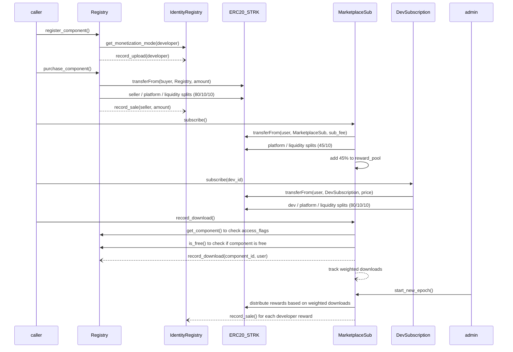

# StarkFlux — Smart-Contract Suite v2

**🎉 UPDATE: All contracts successfully deployed to Sepolia testnet with v1.2.0 implementations!**

This document describes the **four on-chain contracts** that together form the
StarkFlux marketplace. All contracts have been deployed and are fully functional
on Starknet Sepolia testnet as of May 26, 2025.

## Deployment Status

| Contract | Version | Address | Status |
|----------|---------|---------|--------|
| **IdentityRegistry** | v1.2.0 | `0x079c5e6a08cab253e7bb4b57776d5ed0e66ca06bc01fc65f09fbf5ebdc397274` | ✅ Deployed |
| **ComponentRegistry** | v1.2.1 | `0x05fce2407338ddba93698b12af82275cbe62e1d9bcf7de63938cea642c894667` | ✅ Deployed |
| **DevSubscription** | v1.2.0 | `0x07c402205781ccd3b48b1b777c82cbc4a8eab20127bc3049fa2f6c7bfcfbc0ae` | ✅ Deployed |
| **MarketplaceSubscription** | v1.2.0 | `0x06e2c90a5fca956dc8c0e014e149c2708cb5ff1e7cf2c9345ff53599efbf90e1` | ✅ Deployed |

---

## 1. ComponentRegistry V2.1 *(deployed and functional)*

| Item              | Details                                                                            |
|-------------------|------------------------------------------------------------------------------------|
| **Purpose**       | Catalogue components, hold pricing, trigger one-shot purchases, dispatch admin config |
| **Version**       | v1.2.1 - Enhanced with complete functionality                                      |
| **Deployed**      | `0x05fce2407338ddba93698b12af82275cbe62e1d9bcf7de63938cea642c894667`              |
| **Storage (main)**| `components`, `purchases`, fee BPs, oracle address, owner, using LegacyMap<felt252, T> |
| **External calls**| *Pragma Oracle* (Sepolia: `0x36031daa264c24520b11d93af622c848b2499b66b41d611bac95e13cfca131a`), **STRK** ERC-20, **IdentityRegistry** |
| **Events**        | `ComponentRegistered`, `ComponentPurchased`, plus ownership / fee update events    |
| **Access-control**| `owner_address` with two-step transfer                                             |
| **Fee logic**     | `_handle_payment_distribution` (seller / platform / liquidity split)               |
| **Oracle guard**  | staleness, zero-price, decimals scaling - fully implemented                       |
| **Error constants**| `ERR_OWNER_ONLY`, `ERR_ALREADY_REGISTERED`, `ERR_PRICE_TOO_LARGE`, etc.          |
| **Additions**     | `record_download` forwarder with access_flags check, FREE component support, is_free() & get_access_flags() view functions, monetization mode enforcement |
| **Fee split**     | Hardcoded seller=8000, platform=1000, liq=1000 (80/10/10 for one-off)             |

---

## 2. IdentityRegistry *(v1.2.0 - completely rebuilt and deployed)*

| Item                  | Requirement                                                                                                                         |
|-----------------------|-------------------------------------------------------------------------------------------------------------------------------------|
| **Purpose**           | Map each developer address to a unique `identity_id`; track upload count and cumulative STRK sales; manage monetization mode       |
| **Version**           | v1.2.0 - Completely rebuilt from non-functional v1.1.0                                                                              |
| **Deployed**          | `0x079c5e6a08cab253e7bb4b57776d5ed0e66ca06bc01fc65f09fbf5ebdc397274`                                                             |
| **Storage**           | Fixed storage using LegacyMap<felt252, T> pattern with helper functions for clean abstraction                                       |
| **Events**            | `IdentityRegistered{id,owner}` · `UploadRecorded{id}` · `SaleRecorded{id,amount}`                                                 |
| **External API**      | `register()` · `get_identity(id)` · `get_id(owner)` · `record_upload(owner)` · `record_sale(owner,amount)` · `set_monetization_mode(mode)` · `get_monetization_mode(owner)` |
| **Access-control**    | `onlyComponentRegistry` guard on both *record_* functions; owner can `set_registry_address`                                        |
| **Error codes**       | `ERR_ALREADY_REGISTERED`, `ERR_NOT_REGISTERED`, `ERR_NOT_COMPONENT_REGISTRY`, `ERR_ZERO_ADDRESS`                                   |
| **Implementation**    | Uses felt252 key generation pattern: `id.into() * 1000000 + 'identifier'` for unique storage keys                                  |
| **Monetization Modes**| 0: Free-only (no BUY flag allowed), 1: Paid allowed (default)                                                                      |

---

## 3. MarketplaceSubscription *(v1.2.0 - deployed with fixed storage)*

| Item                  | Requirement                                                                                                                         |
|-----------------------|-------------------------------------------------------------------------------------------------------------------------------------|
| **Purpose**           | Provide **renewable, market-wide subscription** access to components flagged with MKT_SUB access flag, with pooled rewards           |
| **Version**           | v1.2.0 - Fixed storage implementation with epoch management                                                                         |
| **Deployed**          | `0x06e2c90a5fca956dc8c0e014e149c2708cb5ff1e7cf2c9345ff53599efbf90e1`                                                            |
| **Storage**           | ```cairo
struct Storage {
  subscription_expiry: LegacyMap<ContractAddress /*user*/, u64>,
  weighted_dl: LegacyMap<(ContractAddress /*developer*/, u64 /*component_id*/), u64>,
  seen_this_epoch: LegacyMap<(ContractAddress /*user*/, ContractAddress /*dev*/, u64 /*comp_id*/), bool>,
  reward_pool_strk: u128,
  epoch_start_timestamp: u64,
  epoch_end_timestamp: u64,
  subscription_fee_strk: u128,
  oracle_price_cfg: OraclePriceCfg,
  new_user_bonus: u8, // multiplier for first-time downloads
  // Address & fee settings
  owner_address: ContractAddress,
  registry_address: ContractAddress,
  id_registry_address: ContractAddress,
  strk_token_address: ContractAddress,
  platform_treasury_address: ContractAddress,
  liquidity_vault_address: ContractAddress,
}
``` |
| **Config params**     | `strk_token_address`, `platform_treasury_address`, `liquidity_vault_address`, `oracle_address` |
| **Events**            | `Subscribed{user,expiry,price}` · `SubscriptionFeeChanged{old_fee,new_fee}` · `EpochStarted{start,end,reward_pool}` · `DownloadRecorded{user,developer,component_id,weight}` · `RewardPaid{developer,amount}` |
| **External API**      | `subscribe()` · `record_download(user,component_id)` · `start_new_epoch()` · `set_subscription_fee(new_fee)` · `set_subscription_fee_usd(new_fee_usd,feed_id,max_staleness)` · `is_subscribed(user)` · `get_price()` · `get_price_usd()` |
| **Fee logic**         | Fixed 45/45/10 split (developer/platform/liquidity)                                                         |
| **Weight formula**    | +2 for first-ever wallet·component, else +1; square-root dampening on payout                                |
| **Oracle support**    | USD pricing with Pragma Oracle integration and staleness checks                                             |
| **Inter-contract**    | • Check access flags via `ComponentRegistry.get_component` (view) <br>• STRK `transferFrom` user → MarketplaceSub then split <br>• Check for FREE components via `ComponentRegistry.is_free` <br>• Distribute rewards to developers via STRK transfers |
| **Error codes**       | `ERR_NOT_ELIGIBLE`, `ERR_ALREADY_SUBSCRIBED`, `ERR_SUB_EXPIRED`, `ERR_EPOCH_ACTIVE`, `ERR_REWARD_DISTRIBUTION`, `ERR_ORACLE_PRICE_STALE` |
| **Access-control**    | Public subscribe; admin-only epoch management & fee setting                                                  |
| **Constants**         | `EPOCH_LENGTH = 2,592,000 s (30 d)` · `GRACE_WINDOW = 21,600 s (6 h)`                                       |

---

## 4. DevSubscription *(v1.2.0 - deployed with Oracle integration)*

| Item                  | Requirement                                                                                                                         |
|-----------------------|-------------------------------------------------------------------------------------------------------------------------------------|
| **Purpose**           | Provide **renewable, developer-specific subscription** access to components flagged with DEV_SUB access flag                           |
| **Version**           | v1.2.0 - Fixed storage with Oracle USD pricing support                                                                              |
| **Deployed**          | `0x07c402205781ccd3b48b1b777c82cbc4a8eab20127bc3049fa2f6c7bfcfbc0ae`                                                            |
| **Storage**           | ```cairo
struct Storage {
  subscriptions: LegacyMap<(ContractAddress /*dev*/, ContractAddress /*user*/), u64 /*expiry*/>,
  prices: LegacyMap<ContractAddress /*dev*/, u128>,
  oracle_prices: LegacyMap<ContractAddress /*dev*/, OraclePriceCfg>,
  // Address & fee settings
  owner_address: ContractAddress,
  id_registry_address: ContractAddress,
  strk_token_address: ContractAddress,
  platform_treasury_address: ContractAddress,
  liquidity_vault_address: ContractAddress,
  oracle_address: ContractAddress,
}
``` |
| **Config params**     | `strk_token_address`, `platform_treasury_address`, `liquidity_vault_address`, `oracle_address` |
| **Events**            | `Subscribed{user,developer,expiry,price}` · `PriceChanged{developer,old_price,new_price}`      |
| **External API**      | `subscribe(developer)` · `set_price(price)` · `set_price_usd(price_usd,feed_id,max_staleness)` · `is_subscribed(user,developer)` · `get_price(developer)` · `get_price_usd(developer)` |
| **Fee logic**         | Fixed 80/10/10 split (developer/platform/liquidity)                                               |
| **Oracle support**    | USD pricing with Pragma Oracle integration and staleness checks                                  |
| **Inter-contract**    | • Identity verification via `IdentityRegistry` <br>• STRK `transferFrom` user → DevSubscription then split |
| **Error codes**       | `ERR_INVALID_DEVELOPER`, `ERR_INVALID_PRICE`, `ERR_NOT_AUTHORIZED`, `ERR_ORACLE_PRICE_STALE`     |
| **Access-control**    | Public subscribe; developer or owner can set price                                               |
| **Constants**         | `SUBSCRIPTION_PERIOD = 2,592,000 s (30 d)` · `PLATFORM_FEE_BPS = 1000` · `LIQUIDITY_FEE_BPS = 1000` · `DEVELOPER_FEE_BPS = 8000` |

---

### Cross-contract flow diagram



---

### Global Token-Flow Table

| Revenue type          | Developer | MarketplaceVault| LiquidityVault  |
|-----------------------|-----------|-----------------|-----------------|
| One-off licence       | 80%       | 10%             | 10%             |
| Marketplace sub       | 45% (via reward_pool)| 45% | 10%             |
| Developer sub         | 80%       | 10%             | 10%             |
| FREE components       | N/A       | N/A             | N/A             |

---

### AccessFlags

The marketplace supports four types of component monetization:

| Flag         | Value | Description                                   |
|--------------|-------|-----------------------------------------------|
| BUY          | 1     | One-time purchase required                    |
| DEV_SUB      | 2     | Available via developer subscription          |
| MKT_SUB      | 4     | Available via marketplace subscription        |
| FREE         | 8     | Free for everyone to download                 |

Notes:
- The FREE flag cannot be combined with other flags
- FREE components must have zero price
- Components can only use BUY flag if developer has monetization_mode != 0
- Appropriate validation exists in register_component() and update_component()
- purchase_component() blocks purchases of FREE components
- is_free() and get_access_flags() view functions help UI handle components